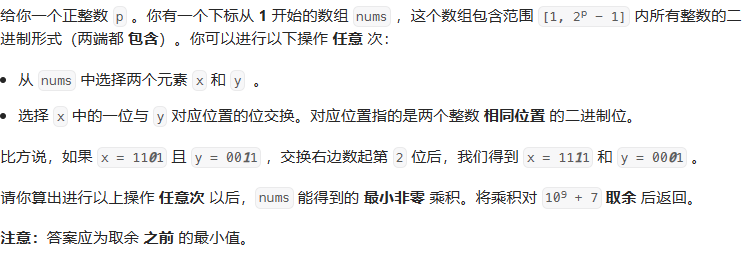

### 贪心算法
```
给你一个正整数 p 。你有一个下标从 1 开始的数组 nums ，这个数组包含范围 [1, 2p - 1] 内所有整数的二进制形式（两端都 包含）。你可以进行以下操作 任意 次：

+ 从 nums 中选择两个元素 x 和 y  。
+ 选择 x 中的一位与 y 对应位置的位交换。对应位置指的是两个整数 相同位置 的二进制位。
比方说，如果 x = 1101 且 y = 0011 ，交换右边数起第 2 位后，我们得到 x = 1111 和 y = 0001 。

请你算出进行以上操作 任意次 以后，nums 能得到的 最小非零 乘积。将乘积对 109 + 7 取余 后返回。

注意：答案应为取余 之前 的最小值。
```

### solution
对于 `a<b<c` 三个数，要使得a*b*c 乘积最小
+ 减小最小的
    (a-1)*b *c  减小了 bc , 减小的最少
    a * (b-1) *c 减小了 ac
    a * b * (c-1) 减小了 ab

+ 增大最大的
  + (a+1) *b *c  增加了 bc , 增大的最多
  + a * (b +1) *c  增加了 ac
  + a *b * (c +1)  增加了 ab 增加的最小。

对于 [1, 2^p -1] p =3
1 -> 减小 1 -> 0  (1 减小1 给 6，因为 7 是最大的全1 没法给)
2 -> 减小 2 -> 0
3 -> 减小 3 -> 0
4 -> 增加 3 -> 7
5 -> 增加 2 -> 7
6 -> 增加 1 -> 7
7

因为乘积不能为 0，所以 将 7 的最低位给 0
最后为 `1 1 1 6 6 6 7` $ $ 
6 和 1 的个数都为 $ N =\frac{2^p-1 -1}{2} = 2^{p-1} -1 $

$( 2^p -1) * (2^p -2)^N  * 1^N  $

