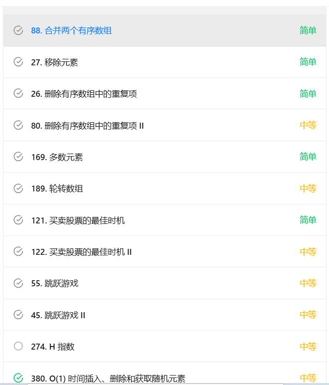
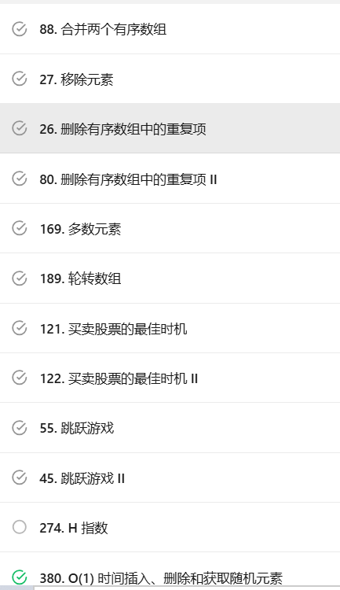
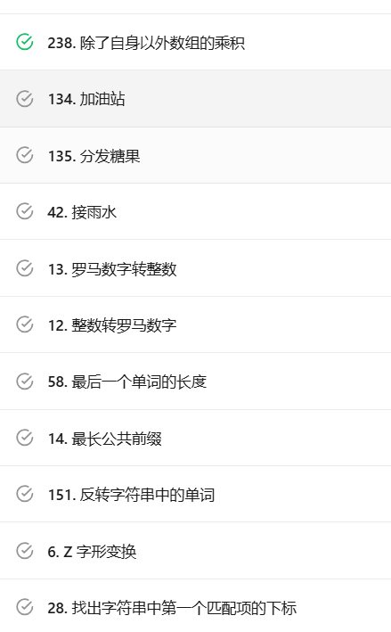
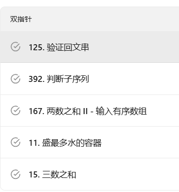
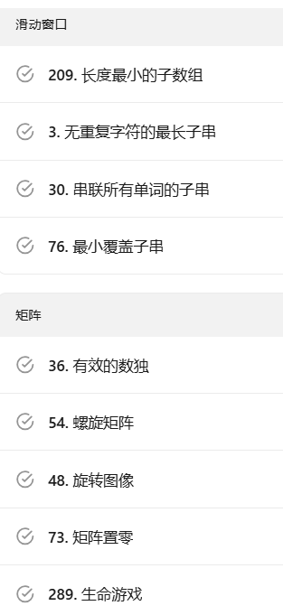
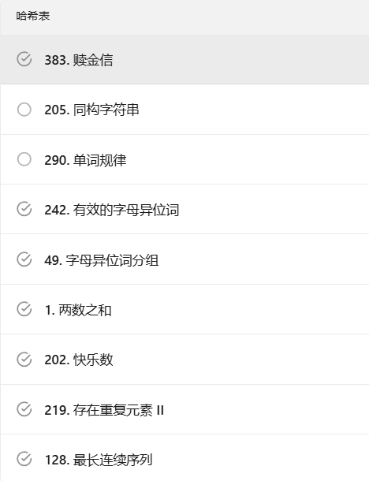
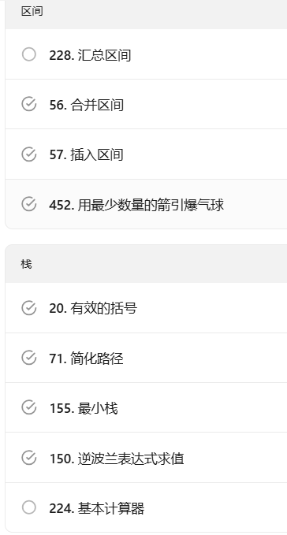
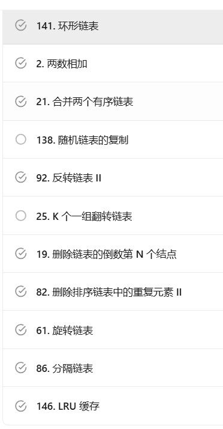
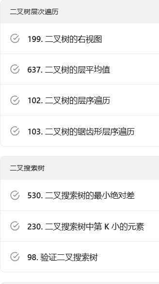
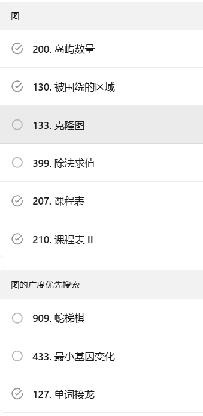

### 贪心策略
3397
1262

### 动态规划

https://leetcode.cn/problems/merge-sorted-array/description/?envType=study-plan-v2&envId=top-interview-150

### 二叉树
1. 层序遍历
1161 -- 队列

2. 前序，中序，后序遍历

### 面试经典150题

68.cpp

二叉树
104
100
226
101
105 106
117 114
112
129
124
173 222 236

210

909
433
127
字典树
208 211 212

回溯
17 77 46 39 52 22 79
分治
108 148 427 23

Kadane 算法
53. 最大子数组和
中等

918. 环形子数组的最大和
中等

二分查找
35. 搜索插入位置
简单

74. 搜索二维矩阵
中等

162. 寻找峰值
中等

33. 搜索旋转排序数组
中等

34. 在排序数组中查找元素的第一个和最后一个位置
中等

153. 寻找旋转排序数组中的最小值
中等

4. 寻找两个正序数组的中位数
困难

堆
215. 数组中的第K个最大元素
中等

502. IPO
困难

373. 查找和最小的 K 对数字
中等

295. 数据流的中位数
困难

位运算
67. 二进制求和
简单

190. 颠倒二进制位
简单

191. 位1的个数
简单

136. 只出现一次的数字
简单

137. 只出现一次的数字 II
中等

201. 数字范围按位与
中等

数学
9. 回文数
简单

66. 加一
简单

172. 阶乘后的零
中等

69. x 的平方根
简单

50. Pow(x, n)
中等

149. 直线上最多的点数
困难

一维动态规划
70. 爬楼梯
简单

198. 打家劫舍
中等

139. 单词拆分
中等

322. 零钱兑换
中等

300. 最长递增子序列
中等

多维动态规划
120. 三角形最小路径和
中等

64. 最小路径和
中等

63. 不同路径 II
中等

5. 最长回文子串
中等

97. 交错字符串
中等

72. 编辑距离
中等

123. 买卖股票的最佳时机 III
困难

188. 买卖股票的最佳时机 IV
困难

221. 最大正方形