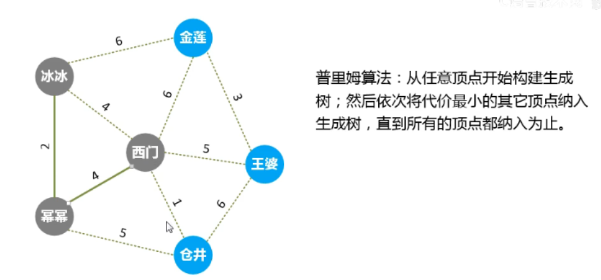

# 图

+ 无向图(无向加权图,无向无权图)
+ 有向图(有向加权图,有向无权图)

## 图的遍历

+ 图的遍历
  广度优先搜素(BFS)
  深度优先搜素(DFS) 2560.cpp 树

## 最小生成树
https://www.bilibili.com/video/BV1oN411Q7Yz?p=68&vd_source=089c30965b1a20cea28e1699e381e5f6
```
基本概念
普利姆算法(Prim)
克鲁斯卡尔算法(Kruskal)
```
+ 普利姆算法(Prim)

从任意顶点开始构建生成树，然后依次将代价最小的其他顶点纳入生成树，直到所有的顶点都纳入为止

+ 1584.连接所有点的最小费用

## 图的应用 最短路径

```
最短路径的应用主要有两种
1)单源最短路径: 从某顶点发，到其它全部顶点的最短路径
2)顶点间的最短路径:全部顶点( 每对)之间的最短路径
最短路径的结果主要有两个方面
1)顶点之间最短路径的长度;
2)从源而点到目的顶点之闻的路径( 途经项点的序列)
```

```
BFS算法   00_图.cpp   2304. 网格中的最小路径代价
Dijkstra 算法   1631_2.cpp
Floyd 算法    00_图.cpp 1334. 阈值距离内邻居最少的城市
```

## 网络联通性

### 有向图和无向图的环的判断

```
无向图
方法1（数学方法）： 图的顶点数为n，边数为m，若n>=m+1，则无环;否则有环。
方法2：使用并查集进行判断。
方法3：DFS。使用visited数组辅助判断是否访问过。

有向图
方法1：拓扑排序。每次取出入度为0为节点，并删除对应的边，如果最后还有节点则有环。
方法2：DFS。使用一个color数组表示节点类型，color[i]=0表示该节点未被访问，color[i]=1表示该节点正在当前访问的路径中或该节点存在于环路中，color[i]=2表示该节点是安全不存在于环中的。
参加leetcode 802： https://leetcode-cn.com/problems/find-eventual-safe-states/
leetcode 207

 判断有向图中是否有环
 + 207 DFS , 拓扑排序
 + 117 二叉树层序遍历

```

### 拓扑序

207 (拓扑排序)

定义一个 tuple 的数组，<key, 入度，邻接表>
将入度为 0 的节点入队，然后将相邻的节点入队
入度为 0 的节点出队，相邻的节点的入度减一
所有节点出队，则输出一个可行方案

### 并查集

+ 2316 统计无向图中无法互相到达点对数 (超时)

# 字典序

+ 面试题 17_15 最长的单词

---

# A

## B

### DFS

1462

### BFS

### 优先队列

+ 大顶堆 (每个节点的值都 >= 子节点的值)
+ 小顶堆 (每个节点的值都 <= 子节点的值)
  插入 删除 查找
  215.cpp 218.cpp 优先队列.cpp

大整数
P1096 汉诺塔

### 网络连通性

并查集

# 单调队列 与单调栈
## 单调队列
单调队列 是 队列中元素之间的关系具有单调性，而且，队首和队尾都可以进行出队操作，只有队尾可以进行入队操作，本质是有双端队列deque实现的。

## 单调栈
顾名思义，单调单调，不就是数据有序的栈吗？所以单调栈分为两种：
1.单调递增栈
2.单调递减栈
让我们归纳下：栈内的元素，按照某种方式排序下（单调递增或者单调递减), 如果新入栈的元素破坏了单调(有序)性，就弹出栈内元素，直到满足单调(有序)性。
(这里所说的顺序是出栈顺序)
而且单调栈可以很方便地求出某个数的左边或者右边第一个比它大或者小的元素，总时间复杂度O ( N ) O(N)O(N)。(这令人心动的复杂度)


+ 239 滑动窗口最大值 单调队列
  https://blog.csdn.net/qq_53268869/article/details/122870945

  https://codeantenna.com/a/k2XQvDrPY6
  https://blog.51cto.com/u_15744744/6212409
  https://zhuanlan.zhihu.com/p/645049338

LEETCODE 85 最大矩形 ？
HZ_271
LEETCODE 239 滑动窗口最大值 单调队列
LEETCODE 84 柱状图中最大矩形 单调栈

# 动态规划

1155 骰子的数量
P1096 二阶汉诺塔
HZ_43 数字三角形 (需要用到大整数)
HZ_47 0-1 背包
HZ_48 完全背包
HZ_49 多重背包
HZ_44 最长上升子序列 (超时)
HZ_45 最长公共子串

### 区间 DP

HZ_46 切割回文串 (未验证)

#### 动态规划的优化

### 未完成

HZ_245 货仓选址

# 股票问题
+ 2034.股票价格波动 优先队列自定义排序
+ 901.股票价格跨度
+ 2291.最大股票收益
+ 1393.股票的资本损益
+ 121.买卖股票的最佳时机
+ 2898.最大线性股票得分
+ 123.买卖股票的最佳时机 III
+ 122.买卖股票的最佳时机 II
+ 188.买卖股票的最佳时机 IV
+ 2110.股票平滑下跌阶段的数目
+ 714.买卖股票的最佳时机含手续费
+ 309.买卖股票的最佳时机含冷冻期
+ LCR 170.交易逆序对的总数


# Kadane算法
Kadane算法（Kadane’s Algorithm）是一种用于解决最大子数组和问题（Maximum Subarray Sum Problem）的动态规划算法。该问题的目标是在给定整数数组中找到一个连续的子数组，使其元素之和最大。Kadane算法的时间复杂度为O(n)，其中n是数组的长度，因此它是解决这个问题的高效方法
https://blog.csdn.net/weixin_51506327/article/details/133344299
1. 初始化两个变量：currentMax（用于跟踪当前子数组的最大和）和globalMax（用于跟踪全局最大子数组的和）。初始值都可以设为数组的第一个元素。
2. 遍历数组中的每个元素，从第二个元素开始：
    a. 更新currentMax，将其设置为 (当前元素值) 与(currentMax + 当前元素值)中的较大者。这表示在当前位置考虑是否要继续扩展子数组，或者从当前位置重新开始一个新的子数组。
    b. 更新globalMax，将其设置为currentMax和globalMax中的较大者。这表示我们始终跟踪最大子数组的和。
3. 继续遍历数组的剩余元素，并重复步骤2。
4. 返回globalMax作为最大子数组的和。


+ 53
+ 918


# 整理一些STL的排序
+ vector
+ pair
+ tuple
+ priority_queue<pair<int,int>,vector<pair<int,int>>,MyCompareMAX>maxQue
+ set unordered_set
+ multiset unordered_multiset
+ map unordered_map
+ multimap unordered_multimap

# 二分
+ 2861.cpp
+ 2476.cpp


取模
long long mod = 1e9 + 7;


resize 前需要先clear
全局变量尽量定义在 class 里面
进制转换 1391.cpp