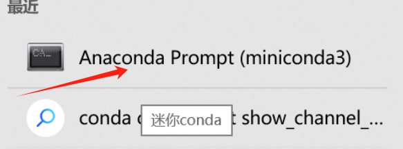

### python 环境搭建：
#### 1. 安装 python 

#### 2. 按照 miniconda,搭建虚拟环境
Miniconda3-py37_4.9.2-Windows-x86.exe

配置conda 源：

```
移除所有通道配置‌：
conda config --remove-key channels
‌重新添加可靠的通道‌：
conda config --add channels https://mirrors.tuna.tsinghua.edu.cn/anaconda/pkgs/main/
conda config --add channels https://mirrors.tuna.tsinghua.edu.cn/anaconda/pkgs/free/
conda config --add channels https://mirrors.tuna.tsinghua.edu.cn/anaconda/cloud/conda-forge/
```

#### 3. 创建环境


在 conda shell 中不是在cmd shell 中 ！！！！

```shell
#创建环境：
conda create --name myenv python=3.8
#查询已创建环境
(gymlab)E:\env>conda env ist
# 激活使用
(gym1ab)E:\env>activate myenv
e:
cd env
#安装所需要的包
pip install -y you-get
```


#### 4.运行程序
```shell
cd  E:\github代码集合\my_leetcode\other\python\
#运行程序
python figure.py
```