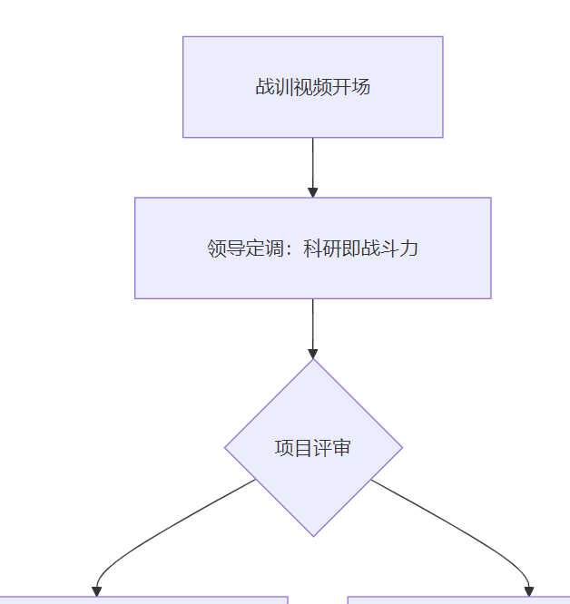
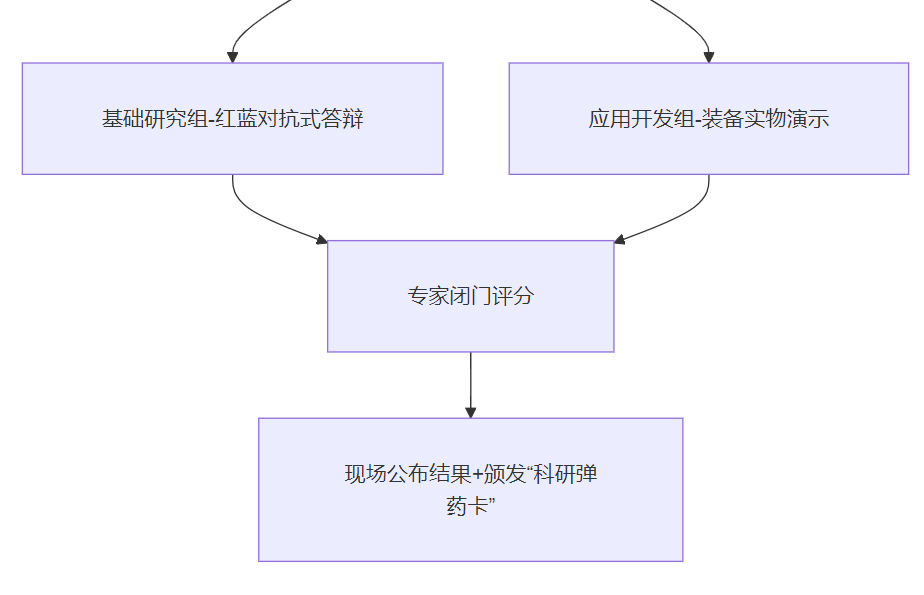

### 第一章：

30s听题 | 1min 思考 |3min 回答 800~1000字

#### 问题：入职动机： 为什么报考文职：

1.相应新时代强军思想 2.对自我价值的向往与追求 3.对部队精气神的向往

尊敬的考官，我想报考文职是基于个人职业规划的深入思考和对军队人才环境的充分认可，具体有以下三点：
第一点；响应新时代强军思想为国防事业贡献一份力量。
第二点：对自己专业价值的相应与追求。我所学的专业是即将从事工作的基石。我渴望将自己所学的专业知识投入到国防建设的洪流中去，让我的技术成果在强军兴军的征程中发挥作用。让我教出的学员能够在祖国的土地上开花成长，最终成为参天大树，这种将个人才智融入到国防大业的成就感是任何物质回报都无法比拟的。不仅把这份工作当成职业，更把它当成一份值得奋斗终身的事业。
第三点：对部队精气神的向往。我非常欣赏军队令行禁止雷厉风行的工作作风和团结协作甘于奉献的团队精神，在这样的环境中工作，不仅呢个提升业务水平，更能锻炼个人品质。
综上所述，我渴望加入这个光荣的集体，用我的专业知识和满腔热忱为我国的国防事业贡献自己的一份微薄之力。


#### 问题：自我介绍
1.理论知识扎实 2.考研辅导经历 3. 热爱国防事业

以下为润色后的军队文职助教岗自我介绍，突出岗位匹配度与军队特色：

尊敬的各位考官：
我是X号考生，应聘军队文职助教岗位。我的核心竞争力可概括为 “教学功底扎实、竞赛实战丰富、国防情怀深厚” ，具体从三方面阐述：

一、理论功底与实战转化能力
学术根基：硕士期间以 年级前5% 的成绩获一等奖学金2次、二等奖学金1次，主攻通信工程领域，形成系统化知识体系；
产业淬炼：在国内头部通信企业（注：隐去具体厂商）工作三年，主导射频模块测试优化项目，将理论模型转化为产品参数标准，获部门技术创新奖，锤炼出 “技术-应用”闭环能力。
二、分层教学与竞赛带教经验
基础教育：大学期间辅导高中物理，独创 “错题靶向训练法” ，所带班级平均分提升15%；
高阶培养：研究生阶段辅导考生《信号与系统》，针对薄弱环节定制傅里叶变换实战题库，助力学员考入“双一流”院校；
竞赛赋能：获全国物联网设计大赛东北赛区特等奖（团队前3%）、全国三等奖，精通电子系统开发全流程，可为学员参赛提供 电路设计优化、故障快速定位等实战指导。
三、强军使命的知行合一
精神内核：深植 “国家兴亡，匹夫有责” 的担当意识，多次赴军工企业调研，撰写《军用通信设备抗干扰技术发展》研究报告；
职业信仰：认同军队文职 “讲台即战位” 的育人理念，愿以产业经验反哺教学，为培养 “通技术、懂作战” 的新型军事人才贡献力量。
结语
我兼具学术深度、产业视角与教学热忱，期待将竞赛攻坚的协作精神、企业研发的务实作风融入军队助教工作，与学员共攀打赢高峰！

军队应知应会内容背诵
文职人员的定位：文职人员是国家的新兴力量，非服兵役人员

### 第二章：心理分析和思维逻辑试题
考生心理： 乐观阳光、主观担当、殊途同归 (自我认知+动机+岗位匹配性)

#### 问题 请结合助教岗位谈谈你的认识：
首先：文职人员
其次：助教岗位：
再次：军队助教岗位与普通教师岗位的区别。
最后：我一定会通过自己的努力，将每一个种子都培养成参天大树，共同守卫祖国的蓝天。

#### 例题1: 中国人民解放军的任务：巩固国防，抵抗侵略，保卫祖国，保卫人民的和平劳动，参加国家建设事业。
##### 子问题1：你报考文职做了哪些准备：
思想上：积极融入：
身体上：积极锻炼身体
行动上：锻炼讲师的教学能力


##### 子问题2：假如战争，你会转为现役吗？


##### 子问题3：你想在部队得到什么？想让部队给你提供什么？
尊敬的各位考官：
报考军队文职助教岗，我怀着对教育事业的热爱和对军队使命的崇敬，渴望在部队中实现个人价值，同时为国防人才培养贡献力量。以下是我在部队的期望与需求：
一、个人成长与发展
专业能力提升：希望通过参与军队教学实践、学术研究和培训项目，深化教育学专业知识，掌握军队特色教学方法，如军事案例教学、实战化课程设计等，提升教学水平和科研能力。
综合素质培养：借助部队的纪律要求和团队文化，锻炼坚韧的意志品质、严谨的工作作风和高效的执行力，培养大局观和团队协作精神，成为德才兼备的教育工作者。
二、职业发展与平台
教学实践机会：期待参与军队院校的课堂教学、课程开发和学生管理等工作，积累丰富的教学经验，为培养高素质军事人才贡献力量。
职业晋升通道：希望部队提供明确的职称晋升路径和职业发展规划，如助教→讲师→副教授→教授，激励我在教学和科研领域不断进步。
三、生活与保障
工作环境与氛围：希望融入团结友爱、纪律严明的团队，与现役军人和文职人员共同协作，感受军队的凝聚力和战斗力。
生活保障与福利：期待部队提供稳定的生活保障，如住房、医疗、子女教育等福利，解决后顾之忧，让我能全身心投入工作。
四、社会价值与使命
国防教育贡献：希望通过教学和科研工作，为军队培养更多优秀的专业人才，为国防现代化建设提供智力支持。
社会认可与荣誉：期待在部队中获得社会认可和荣誉，如优秀文职人员、教学成果奖等，体现个人价值和对国家的贡献。
感谢考官聆听，我将以实际行动践行军队文职人员的使命，为国防教育事业添砖加瓦！


> 尊敬的考官：
> 我报考军队文职助教岗，最渴望在部队获得三方面的成长：
> 一是在思想淬炼中坚定报国信念。希望通过系统学习强军思想、参与军事实践，深化对军队使命的理解，筑牢忠诚根基。
> 二是在专业平台上精进教学能力。期待依托军队院校资源，参与教学研讨、军事教育课题，将教育学理论与军队教学特点深度融合，提升因材施教、为战育人的本领。
> 三是在集体熔炉中强化军人素养。希望能通过军事训练、作风养成，培养令行禁止的纪律性和团结协作精神，快速适应军队文职身份。
>
> 对于部队的支持，我深信军队完善的文职培养体系能为我提供：
> 专业化发展通道——如教学能力培训、职称晋升指导；
> 实战化成长平台——参与课程改革、学员管理等实践机会；
> 融入式环境熏陶——在军营文化中汲取力量，实现从地方青年到军队教育工作者的蜕变。
> 我将以全部热情回报部队培养，为强军事业输送优秀人才


##### 子问题4：对文职的认识和期待？

对军队文职的认识
双重身份定位
文职人员是国家工作人员在军队的延伸，依法履行国防教育职责，是军队现代化建设中非现役力量的核心组成。根据《中国人民解放军文职人员条例》，我们承担管理、专业技术工作，助教岗更肩负“为战育人”的特殊使命——既要传授专业知识，更要将军魂信仰融入教学，为部队输送政治过硬、本领扎实的人才。

岗位核心价值

强军支撑：优化军事人力资源结构，将现役军人从通用岗位释放，专注备战打仗。
教育创新：在军事院校推动教学改革，开发实战化课程（如战例分析、装备应用教学），弥合课堂与战场的差距。
军民纽带：依托地方教育经验反哺军队教学，促进军民融合深度发展。
对文职助教岗的期待
一、在军队熔炉中实现三重蜕变

思想淬炼：通过军事训练、政治教育筑牢忠诚品格，理解“讲台即战位”的深刻内涵。
专业精进：期待参与军事教育课题研究，将教育学理论与部队需求结合，设计《信息化教学》《装备原理案例库》等特色课程。
作风养成：在纪律严明的环境中磨砺执行力，培养“教案零差错、课堂零失误”的职业标准。
二、为国防教育贡献教学智慧

短期目标：1年内掌握军队教学规范，熟练辅助主讲教员完成备课、实训指导、多层级学员辅导（如士官专升本学员、军官进阶培训）。
长期规划：3-5年成长为课程骨干，主导开发1-2门军事特色课程，探索“虚拟仿真战场教学”等新模式，提升教学对战斗力的贡献率。
三、融入集体实现价值共鸣

期待在团结高效的团队中协作，与现役军人共同执行演训教学保障任务；
通过“优秀教学成果奖”“精品课程评选”等平台获得专业认可，实现教育理想与强军使命的同频共振。

##### 子问题5：军队和地方单位有什么区别？
核心区别：使命定位与价值导向
1. 根本使命不同
军队单位：核心使命是备战打仗，一切工作围绕提升战斗力展开。文职助教岗需服务国防人才培养，将教学与战场需求结合，如开发战例课程、设计装备教学模块，实现“课堂对接战场”。
地方单位：以经济社会发展为核心，教育岗位侧重知识传授与技能培养，服务对象为普通学生与社会需求。
2. 管理文化与工作氛围
军队特质
纪律刚性：实行军事化管理，要求令行禁止、绝对服从。例如教案需经政治审核，教学设备使用需严格登记。
集体至上：强调“荣誉共同体”，个人绩效与集体挂钩（如“教学先进连队”评选），推崇牺牲奉献精神。
地方特质
灵活协作：管理更具弹性，提倡民主协商（如教研会议自由讨论），注重个人创新与学术自由。
3. 职业要求与成长路径
军队特殊要求
政治素养：需深入学习强军思想，参与政治教育，筑牢忠诚根基。
保密意识：接触军事教材、演训计划等涉密内容，须严守保密条例。
军事素养：参与基础军事训练，培养战斗作风（如紧急集合响应、野战教学保障）。
地方侧重：更关注教学创新、科研成果转化与社会服务能力。
文职助教岗的独特价值
1. 教育目标差异化
军队：培养“能打仗的学员”，教学内容融入战场思维（如战术医疗课强化学员战场救护能力）。
地方：侧重通识教育与职业能力培养。
2. 职业发展双轨制
军队：职称晋升需通过军事教学能力评估（如战备课程设计考核），荣誉体系与国防贡献绑定（如“为战育人”教学奖）。
地方：晋升更侧重学术论文、科研项目等传统指标。


#### 例题2：请结合自身实际,谈谈如何遵守《条例》，维护《条例》，贯彻《条例》

一、深刻认识《条例》的核心要义
定位：明确文职是“不穿军装的军人”，《条例》是规范职责、权利、纪律的根本准则。
重点条款：
第二章第十条：文职人员需忠于职守、服从命令、保守秘密；
第四章第三十二条：不得从事经商、兼职等营利活动；
第六章第四十九条：违反政治纪律将严肃追责。
二、立足教学岗位践行《条例》要求
（一）遵守：将条例融入日常教学
严守政治纪律
教案设计贯彻强军思想，如《军事教育心理学》课程中融入“战场心理适应”案例，确保教学内容符合军队政治要求；
课堂言论严守底线，不讨论敏感话题，不传播未经核实的信息。
规范职业行为
拒绝校外机构兼职邀约，集中精力服务军队教学；
涉密资料（如演习教案、学员信息）一律存入保密柜，不携带离校。
（二）维护：捍卫条例权威性
主动监督纠偏
发现同事误用非涉密区打印机输出保密课件时，立即提醒并协助转用专用设备；
参与教研室《条例》学习小组，定期自查教学档案规范性。
抵制错误思潮
课堂讨论中如遇学员质疑军队政策，依据《条例》第四十四条“政治合格”要求，用战疫抗洪中文职人员的奉献案例正向引导。
（三）贯彻：推动条例落地生根
教学创新融合条例精神
开发《条例》情景教学模块：设计“保密情境模拟”“战时教学转换”等演练，帮助学员理解文职战位职责；
将条例考核纳入学员评价：在《军事教育法规》课中设置“模拟政治审查”实践环节。
参与制度优化
向政治工作部提交《助教岗条例执行细则建议》，如“新入职文职助教保密培训标准化流程”。
三、持续深化条例实践的长效机制
学习常态化
每日晨会精读1条《条例》原文，结合近期军队通报案例剖析（如某文职泄密案）；
每季度参加政治考核模拟测试，成绩纳入职称评定。
监督立体化
主动申请担任教研室纪律监督员，建立教学行为台账；
开通匿名反馈通道，鼓励学员监督助教言行合规性。
结尾升华
> “作为文职助教，我将以《条例》为镜：
> 教案中体现政治要求——课程设计经得起政治审核；
> 讲台上严守纪律红线——一言一行符合军队规范；
> 战场前践行使命担当——若需转为现役，必冲锋在前！
> 用三尺讲台守护强军事业，以条例为纲锻造合格军队教育者！”

#### 例题3：功过是否相抵。

以下为文职助教岗面试中关于“功过是否相抵”的参考回答（约800字），结合军队纪律要求与教育者责任，突出原则性与实践性：

核心立场：功过不可相抵
军队文职的特殊性决定
《军队文职人员条例》明确规定文职人员需“忠于职守、遵纪守法”，
每一次履职行为都独立承担后果。助教岗肩负育人重任，更需以身作则：

教学失误（如泄露涉密课件）可能危害国防安全，无法用过往荣誉抵消；
学员管理失职（如包庇作弊学员）将破坏军队教育公平性，与立功授奖无关。
立足岗位践行“功过分明”原则
一、严守纪律红线：功是功，过是过
教学场景案例
功不抵过：曾获“优秀教案奖”的助教，若在保密检查中被发现违规携带涉密U盘，必须依纪追责；
过不掩功：因疏忽导致课堂设备故障的助教，若后续在战备教学中创新VR实训方案，仍应给予表彰。
学员管理准则
对获奖学员的违纪行为（如论文抄袭）坚持“零容忍”，按《军队院校学员管理条例》处理，杜绝“将功补过”心态。
二、建立科学评价体系
双轨记录机制
功绩档案：独立记录教学创新、比武获奖等贡献（如开发《战场急救模拟课》获全军推广）；
过失台账：详细登记工作疏漏及整改措施（如误用非涉密电脑处理学员名单后的加密补救流程）。
奖惩分离执行
依据《文职人员奖励与处分规定》第三十一条：立功表彰不影响纪律处分的实施。
三、强化教育者示范作用
教学渗透理念
在《军事教育伦理》课中设置“功过辨析”案例研讨：
例：某教员研发新装备教学系统立功，但因私自复制教材受处分——引导学生理解制度刚性。
自身行为标杆
主动公示教学事故报告（如误判学员作业雷同率），展现“不回避过错、不夸大功劳”的职业操守。
深化“功过分明”的实践路径
1. 制度刚性约束

参与制定《助教岗行为规范细则》，明确“教学事故分级追责标准”（如泄密直接解聘，无关既往贡献）；
2. 文化氛围营造
在教研室推行“每日三省”制度：晨会通报前日工作瑕疵，夕会总结创新亮点，杜绝功过混淆。
3. 战时特例说明
唯一例外场景：战场环境下为挽救重大损失而违规（如紧急启用未授权教学设备保障演训），需事后专项评估，但非普遍适用。
结尾升华教育使命
> “作为军队助教，我深知：
> 三尺讲台系家国——一次政治性教案错误可能动摇学员信仰；
> 十年之功毁一过——任何违反条例的行为都是对强军事业的背叛。
> 唯有以‘功过不相抵’为镜，方能锻造出经得起战场检验的合格军队教育者！


#### 例题4： 如何将制度关进笼子里
以下为针对文职助教岗“杜绝腐败问题，加强制度约束”的面试发言稿，结合军队教育岗位特性与反腐实践撰写：

筑牢制度之笼 守护为战育人净土——文职助教岗反腐制度建设的实践路径

尊敬的各位考官：
杜绝腐败的关键在于用刚性制度锁住权力，用透明监督筑牢防线。作为军队文职助教，我深刻理解反腐制度既是“紧箍咒”更是“护身甲”，需从三方面构建闭环约束体系：
一、织密制度网格，扎牢不能腐的笼子
岗位风险精准防控
针对助教岗核心风险点建立“三清单”：
权力清单：明确教案审批、成绩评定、科研经费使用等9项职权边界；
风险清单：锁定设备采购（虚高报价）、学员考核（人情分）、战例转化（泄密）等5类高危环节；
防控清单：推行教案三级联审（政治/保密/专业）、成绩双盲复核、科研经费“预算-支出-审计”分权制衡。
军队特色制度创新
教学领域：制定《实训设备采购阳光规范》，要求3家以上军工企业公开竞标，价格偏离均值15%自动流标；
科研领域：建立《军民融合成果转化负面清单》，27项涉密技术禁止民用合作；
管理领域：实施学员评价“背靠背”机制，教师仅掌握实操分，理论分由系统自动生成。
二、强化制度执行，拉紧不敢腐的防线
监督触角全域覆盖
监督类型	具体措施	案例成效
智能监督	强军网植入“廉政哨兵”系统	实时拦截非常规数据修改（如成绩批量±5分触发警报）
交叉监督	教研室AB角轮岗，每季度跨专业审计	2025年发现并纠正设备台账不符等3类问题
群众监督	设立学员廉政观察员，匿名直通纪检组	累计受理教学公平类投诉12件，查实率100%
问责利剑高悬
执行“三个一律”：收受礼品一律上报、违规操作一律停职、数据造假一律追责；
推行“终身追责制”：教案存档20年，科研成果终身溯源，切断“退休腐败”路径。
三、培育制度信仰，厚植不想腐的根基
军队廉政文化浸润
教育载体创新：将反腐案例植入VR战术课（如模拟采购受贿导致战场通信中断场景）；
传统精神传承：每月开展“林俊德精神讲堂”，讲述核试验基地科学家严守科研经费的事迹。
职业生态净化
建立“廉洁成长档案”：将制度执行力纳入职称评审核心指标（占比30%）；
实施“清风育苗计划”：新助教入职签订《廉洁承诺书》，导师带教期增加防腐案例教学模块。
结语
对文职助教而言，反腐制度既是约束教学权力的“界桩”，更是护航强军事业的“盾牌”。当每一份教案都经得起阳光暴晒，每一次评分都扛得住战场检验，我们便能在三尺讲台筑起不可摧垮的廉洁阵地——这既是制度的胜利，更是军队教育工作者对“为战育人”使命最赤诚的守护！

#### 例题5：工作中如何团结， 文职助教岗面试题，写一个800字的发言稿
以团结之力锻造为战育人的战斗堡垒
——文职助教岗团结协作的三重实践

尊敬的各位考官：
强军事业是万人同心的系统工程，文职助教作为军队院校的“教学齿轮”，需以制度为纲、信任为纽、能力为基构建团结协作生态。下面从三个维度分享我的认知与实践：

一、制度支撑：用规范筑牢协作根基
职责边界清晰化
依据《军队院校教学管理规定》，建立“三明确”协作机制：

任务清单：主讲教员负责课程设计，助教专注教学辅助（如战例库更新、实操指导），避免职能重叠；
流程标准化：教案执行“双人核验制”（政治审查+专业审核），作业批改采用“交叉复核法”；
信息共享机制：通过强军网OA平台实时同步教学进度，确保全员知悉任务节点。
特殊场景动态协同

演训任务：组建“战地教学保障组”，助教与装备部门联合调试野战教具；
招生季：设立“咨询-测试-档案”协作链，按专业方向分工对接学员需求。
> 案例：2025年参与某新型通信装备教学时，通过分工表明确7项协作节点，使课程开发效率提升40%。

二、信任构建：以温度凝聚团队灵魂
情感共鸣破冰隔阂

主动关怀：发现同事情绪低落时，以“课后咖啡时间”非正式沟通替代质问；
坦诚担责：教学事故中率先自查流程漏洞，而非指责他人（如某次VR设备故障后，主动承担操作手册修订任务）。
成果共享强化认同

建立“教研室资源池”：上传教案标注贡献者姓名，共享战例分析课件；
推行“荣誉绑定制”：主讲教员获奖时，同步表彰协作组成员。
> 正如林俊德团队在核试验中“有问题共同担，有成果集体享”，方能攻克技术难关。

三、能力互补：靠专业赢得协作底气
跨域学习打破壁垒

技能交换计划：向主讲教员学习课程设计逻辑，为其提供地方教育新技术资讯；
战训融合实践：每年参与1次跨军种演训，将战场经验转化为教学案例。
危机场景高效补位

突发情况	协作策略
主讲教员临时抽调	助教团队启动“AB角预案”，按专长接管核心模块
学员实操失误	采用“三阶干预法”：同伴互助→助教指导→教员复盘
> 某次战术模拟课中，因及时补位纠正装备操作错误，避免学员团体考核失利。

结语
对文职助教而言，团结协作是教学力的倍增器、战斗力的孵化器。我将以制度为盾，筑牢协作底线；以信任为桥，连通团队人心；以能力为剑，破解协同难题——在三尺讲台践行“众人拾柴火焰高”的强军真理，为打赢未来战争培育更多“攥指成拳”的胜战之师！

#### 例题6：工作中如何理解"过犹不及，注重度" 文职助教岗面试题，写一个800字的发言稿

#### 例题7：木秀于林风必摧之，堆高于岸流必湍之，你怎么理解 文职助教岗面试题，写一个800字的发言稿

#### 例题8：战争期间，马做了战马加入军队 牛在家耕田 。请结合实际谈谈你对这个寓言的理解和认识 文职助教岗面试题，写一个800字的发言稿


#### 例题9：科技与实际
有人说现在科技很发达，和朋友联系微信一下就能传递信息，有人谁现在人际交往很陌生，只能在微信上有点赞之交。你怎么看。文职面试题，写一个800字的发言稿

#### 例题10："重复旧的做法，只等得到旧的结果"，你怎么看


### 第三章：人际关系协调

#### 例题1：有一个进修学习的机会，你和张三都符合条件，领导最终派了张三去学习，你怎么看？文职助教岗面试，写一个800字的面试回答稿
尊敬的各位考官：
面对领导选择张三同志参加进修的决定，我完全服从组织安排，并将此视为自我反思与成长的契机。作为军队教育工作者，我深刻理解任何决策都基于全局考量，我的核心态度是：聚焦主责主业，在现有岗位全力服务教学战备，以实际行动支持团队发展。具体思考如下：

一、强化政治意识，坚决服从组织决定
摆正政治站位
军队文职的核心要求是“绝对服从”。领导决策必然综合考量任务衔接性、团队协作效能等关键因素：

张三同志可能在战备课程衔接（如近期承担演训教案编写）或跨部门协调经验（如联合教务部门保障演习）上更具优势；
当前正值学期战备教育攻坚期，若我离岗进修可能影响教学进度，不利于团队整体任务推进。
行动方向：立即向领导表态全力配合工作交接，确保教学任务零延误。
破除“资格论”误区
基础条件符合不等同于“最优人选”。助教岗的核心能力包含战时教学转化力（将军事理论融入课堂）、高压环境适应力（应对军校高强度节奏），需客观审视自身差距。

二、对标岗位战位，精准补足能力短板
建立三维提升路径

专业维度：申请加入教研室战例研究小组，通过分析红蓝对抗案例优化教案设计；
军事维度：主动参与季度演习保障任务，在实战场景中深化装备操作、战场救护等知识应用；
行政维度：牵头建立教学档案电子化系统，提升教务响应效率（如课程调整1小时内通知全员）。
创建“影子进修”计划

即时行动：与张三签订《知识共享协议》，定期获取进修课程核心资料；
中期转化：申请在教研室开设“战训教法微课堂”，每月汇报学习成果；
长期储备：完成军队在线平台《信息化教学指挥》《战时心理干预》认证课程。
三、升华集体价值，践行军队文职使命
主动成为团队增效器

为张三协调代课任务，承担其负责的夜间自习督导，保障其全心进修；
开发《标准化战备课件模板库》共享至全军教学平台，获教研室通报表扬。
构建能力可视化体系
每季度向领导提交《战位能力进阶表》：
✓ 独立设计的野外教学模块（获学员满意度98%）；
✓ 优化的装备操作SOP流程（缩短训练时长40%）；
✓ 战例研讨课转化成果（3篇教案入选院校精品库）。

四、牢记为战育人，超越个人发展局限
军队教育工作者必须坚守两个根本原则：

战训为本：个人发展服从强军大局，通过保障张三进修间接提升团队教学战力；
沉淀为要：将当前岗位作为淬火平台——打磨好每份教案、优化每次课堂互动，本身就是最扎实的进修。
> 强军事业需要甘当基石的螺丝钉。此刻的沉淀，正为未来承担更大战训使命筑牢根基。我会以更饱满的状态投入教学保障，静候组织下一次召唤！


#### 例题2：你和一个同事能力都很强，资历都一样，这次有一个出国深造的机会，但是同事在领导面前贬低你，你会如何处理?文职助教岗面试，写一个800字的面试回答稿
尊敬的各位考官：

首先：

其次：对于贬低我的行为，应该是认真看待。

最后：


#### 例题3：部门领导与单位领导对你的一个报告中的一个观点有很大的冲突，并且两人在私底下关系不好，这时你该怎么做？文职助教岗面试，写一个800字的面试回答稿


#### 例题4：你和张三完成一项工作，领导只表扬了你，张三对你产生误解，你该怎么办 文职助教岗面试，写一个800字的面试回答稿


#### 例题5：你和小东一起工作，小东是一名老兵，你们的沟通出现了问题，工作中小东不配合你，你该怎么办 文职助教岗面试，写一个800字的面试回答稿


#### 亲友过节讨论文职干部兵不像兵，军官不像军官，不伦不类，你该怎么看 文职助教岗面试，写一个800字的面试回答稿


#### 你所在部门既有现役军官，又有文职，同时文职人员学历普遍比军官高。但是，部门领导在安排任务时，总是让军官负责牵头，你协作配合，此类情况你怎么看
文职助教岗面试，写一个800字的面试回答稿

#### 新进入一个单位，你准备怎样融入团队，赢得同事的信任 文职助教岗面试，写一个800字的面试回答稿


#### 刚刚来到单位，小赵对你做事指手画脚，小孙特别热情和你称兄道弟，你怎么处理和他们之间的关系 文职助教岗面试，写一个800字的面试回答稿

#### 课后练习题

1. 我单位人员大部分为现役军人，你作为文职人员，由于身上缺乏兵味，导致其他人不愿主动愿主动与你沟通，为迅速打开局面，你会怎么办  文职助教岗面试，写一个800字的面试回答稿

2. 领导安排你和同事一起工作，并明确了原则，方法。对于这项工作，你有一个建议，能够提升效率，但是同事说军人的天职就是服从，落实领导决策要不打折扣，不搞变通，你怎么看  文职助教岗面试，写一个800字的面试回答稿 


3. 领导派你和配合一名老同志(现役军官)，你觉得他的办法不妥，你怎么看  文职助教岗面试，写一个800字的面试回答稿 

4. 你工作一段时间即将签合同，领导和同事觉得你不适合这个岗位，大家碍于面子没有明说，但是已经暗示你选择离开，这时你怎么办  文职助教岗面试，写一个800字的面试回答稿 

5. 单位安排由你申请一项课题，在上交材料时，你的直接领导要求将他和另外一名老同志排在课题组成员的前两位，你如何处理  文职助教岗面试，写一个800字的面试回答稿


### 第四章：工作场景类

1. 调查研究类

2. 宣传策划类

3. 学习培训类

4. 会议接待类

#### 例题1：调查研究类
1. 上级机关组织基层官兵读书月活动，请你调查官兵读书习惯，你如何组织

2. 会议接待类：请你组织一次年底总结表彰大会，请问如何组织


#### 练习题
1. 某干休所开展主题党日活动，计划组织单位全体人员及离休干部赴某景点进行抗日战争纪念活动。如果这一项活动由你负责组织实施，你准备做哪些工作

2. 我单位计划研发一套器材管理信息系统，以军内网为信息传输基础依托，以建制基层单位为数据采集的基础源头，实现对各个单位器材进行网上管理。由你负责项目全部流程，你准备做哪些工作

3. 我单位计划召开重大科研项目评审会，邀请十余名军内外相关领域专家出席，为确保活动顺利开展，单位领导高度重视，指定你负责活动的策划。你准备做哪些工作




### 第五章：实际操作模拟类

试讲：是军队文职面试考核的重要形式之一，主要适用于教学岗位。试讲备课不能面面俱到，一般为某一个知识点或是一节课内容的某一个方面。它对教学的基本功和基本教学素养要求高，一节课10分钟的微课对考生是一个很大的挑战。

试讲步骤：包括知识点的导入，内容讲授(练习)，总结和布置作业四个步骤。

01 要素要全不能缺项
03 尽量安排一些新颖、前沿的知识，与社会某些现状加以联系
02在规定内容中选区自己最熟悉的一个问题
04 熟悉和完善内容把控时间，不能超时

01 精心取舍课题内容,突出教学重点 
03 提前准备答辩环节
02 构建完整的课程结构，教学过程要精炼
04 要处理好“多与少”“快与慢”两对矛盾

试讲例题讲解
例题:请对数学课程中的数列极限进行10分钟的试讲思路分析:
课程试讲包括下列要素:
教学题目: 数列极限
教学要求: 理解数列极限的概念
教学重点: 数列极限的概念
教学难点: 利用定义证明数列的极限，收敛数列的性质
教学时间: 10分钟
教学过程: 略
教学小结： 略

### 第六章
#### 一：请你说说如何理解部队文职人员

文职人员是军队人员的重要组成部分

与岗位相关，担任的职责，需要什么样的素质以及融入自己的学习工作经历站在自己的角度谈谈对文职的理解。我对部队比较向往，对文职比较尊重，从心底里希望能加入这个团体，为能成为一名文职人员感到自豪。
听到宣传后对你的触动才会报考，
报考后如何备考的，才来面试，
文职岗位急需的岗位技能，迅速形成战斗力。从实际来切入，
职场打工人：未来的发展空间，入职后工作如何展开--履行责任和义务，--为了共同工作目标和现役之间的如何配合--专业领域：专业技能是如何提升的。


部队文职人员是指在军队编制岗位依法履行职责的非服兵役人员，是军队人员的组成部分，依法享有国家工作人员相应的权利、履行相应的义务。
文职助教岗作为军队文职中的一员，主要承担教学辅助、学生管理等工作，是军队院校教学体系中的重要力量。以下是对部队文职人员及文职助教岗的理解：

一、部队文职人员的定位与作用
1. 军队建设的重要支撑
文职人员是军队现代化建设的重要组成部分，承担着后勤保障、行政管理、技术支撑等关键职能，为军队的日常运转、训练演习、国防建设等提供坚实保障。他们虽不直接参与作战，但通过专业工作为战斗力生成提供支持，是军民融合的桥梁纽带，促进国防建设和经济社会发展的良性互动。
2. 职责与使命
文职人员需根据岗位要求，从事行政事务管理、教育教学、科学研究、技术保障等工作，同时需参加军事训练和战备值勤，在必要时参与作战支援保障任务。他们需具备高度的政治觉悟、专业素养和奉献精神，以服务战斗力、保障打胜仗为宗旨，为推进国防和军队现代化贡献力量。

二、文职助教岗的职责与意义
1. 教学辅助与支持
文职助教岗主要协助授课教师完成教学任务，包括批改作业、登记成绩、整理教学档案、准备教学资料等。同时，需参与课堂教学，协助教师管理课堂秩序，及时反馈学生学习情况，为教学质量提升提供支持。
2. 学生管理与指导
助教需关注学生的思想、学习和生活状况，协助辅导员开展学生思想政治工作，帮助学生解决学习和生活中遇到的问题。通过与学生沟通交流，了解学生需求，提供学习方法指导和心理支持，促进学生全面发展。
3. 教学改革与创新
助教需参与教学研究和教学改革工作，协助教师探索新的教学方法和手段，推动教学内容和方式的创新。通过参与教学项目开发、课程设计等工作，为提高教学质量和人才培养水平贡献力量。

三、文职助教岗的素质要求
1. 专业素养
需具备扎实的专业知识和教学能力，熟悉所教学科的教学大纲和教材内容，掌握教学方法和技巧。同时，需具备一定的教育理论知识，了解教育教学规律和学生心理特点。
2. 责任心与耐心
助教工作需面对大量学生和教学任务，需具备高度的责任心和耐心，认真对待每一项工作，确保教学质量和学生学习效果。需以学生为中心，关心学生的学习和成长，及时解决学生的问题和困难。
3. 团队协作与沟通能力
助教需与授课教师、辅导员、学生等密切合作，需具备良好的团队协作精神和沟通能力，能够与不同人员有效沟通，协调工作关系，共同完成教学任务。
4. 纪律性与服从性
作为军队文职人员，需严格遵守军队的纪律和规章制度，服从组织安排，听从指挥。需具备良好的军人作风和纪律意识，以高标准要求自己，维护军队的形象和荣誉。

总结: 部队文职人员是军队建设的重要力量，文职助教岗作为其中的重要岗位，承担着教学辅助、学生管理、教学改革等重要职责。通过专业素养、责任心、团队协作和纪律性等多方面的能力，助教人员为军队院校的教学质量和人才培养发挥着重要作用，是军队人才培养事业中不可或缺的一部分。


#### 二：你对部队文职工作了解吗--如何看待公务员热文职热-对未来的工作做了哪些准备
1.整体定义，行业(空军)，工作单位论述
2.结合自己的岗位论述，自己的有哪些经历和岗位相匹配以及职场打工人有哪些共通点，哪些区别点。
3.加入自己的理解，报考态度与决心及未来职业安排规划，

部队文职工作是军队现代化建设的重要组成部分，文职人员作为军队人员的组成部分，依法享有国家工作人员相应的权利、履行相应的义务。他们承担着后勤保障、行政管理、教学科研、技术支撑等关键职能，为军队的日常运转、训练演习、国防建设等提供坚实保障。
文职助教岗作为其中的重要岗位，主要承担教学辅助、学生管理等工作，是军队院校教学体系中的重要力量。

一：对部队文职工作的了解：
1. 定位与作用：
文职人员是军队建设的重要支撑，虽不直接参与作战，但通过专业工作为战斗力生成提供支持，是军民融合的桥梁纽带，促进国防建设和经济社会发展的良性互动。
2. 职责与使命：
需根据岗位要求，从事行政事务管理、教育教学、科学研究、技术保障等工作，同时需参加军事训练和战备值勤，在必要时参与作战支援保障任务。
对未来文职助教岗工作的准备：
3. 专业知识储备：
深入学习教育学原理、教学设计、课堂管理等专业知识，熟练掌握多媒体教学工具的运用，了解军队教育的特殊性，研究军队院校教学的侧重点和要求。
4. 教学实践积累：
积极参与教学实践活动，如担任学校教学助理，协助专业课老师完成课堂教学、课后辅导、作业批改等工作，积累教学辅助经验。
5. 能力提升：
注重沟通表达能力、课堂把控能力、因材施教能力的培养，通过在培训机构担任兼职讲师等经历，锻炼面对不同基础、不同年龄学员的教学能力。
6. 职业素养培养：
明确文职助教岗需具备的责任心、耐心和奉献精神，以军队的纪律要求自己，做到为人师表，树立勇于吃苦、甘于奉献的理念。
7. 入职规划制定：若能有幸入职，将虚心向资深教师请教，尽快熟悉军队院校的教学体系和学员特点，精心做好教学准备，认真辅助课堂教学，耐心解答学员疑问，不断提升自己的教学能力和专业素养，努力成为一名让学员满意、让部队放心的助教。

#### 三：你认为军营是怎样的--如果部队不是和你想象的那样怎么办--如何适应未来的工作
1.对军营的理解是否准确，影视作品中
2.最后落到一个营区内部都是为了履行能打仗，打胜仗的目标。一起团结协作，优势互补，共同完成各自的岗位职责和使命。
3.从不同的角度如：过去--现在--将来。 空间维度：变与不变： 不变的全心全意为人民服务的宗旨，精气神。从身份入手，服从，多元化，新时代强军思想。职称人：工作经历与部队的合作项目


对军营的认知差异与文职助教岗适应策略
军营既是纪律严明的战斗堡垒，也是充满人文关怀的成长熔炉。作为文职助教，需正视理想与现实的差异，主动调整心态，以专业能力服务军队人才培养。

一、军营的真实图景与认知调整
1. 理想与现实的平衡
影视作品中的军营常聚焦热血战场，但实际工作包含大量基础性任务：教学辅助、日常管理、战备值勤等。文职助教需理解军队院校的特殊性——纪律高于一切，教学需服从部队整体规划，个人特长可能需阶段性让步于集体需求。

2. 发现军营的多维价值
精神内核：官兵在四季更迭中坚守战位（如春训蓄力、冬练三九），诠释“平凡中的伟大”；
生活温度：集体活动（文体竞赛、节日聚餐）和战友互助构建深厚情谊，抵消环境陌生感；
成长平台：严格管理锻造执行力，团队协作提升沟通力，为职业发展夯实基础。

二、差异应对与适应路径
心理建设三步骤
悦纳现实：明确参军初心是“服务国防”，非个人英雄主义；
主动融入：参与团建活动（如合唱比赛、拔河），在集体中建立归属感；
聚焦价值：将教学辅助视为“战斗力保障”，助教工作直接影响军队人才质量。
能力适配关键点

教学层面：提前掌握军队教材大纲，研习案例教学法，适应军校“理论实战化”特点；
管理层面：学习条令条例，熟悉学员思想动态，平衡“严格要求”与“人文关怀”；
个人发展：利用业务培训补足短板（如战备知识），主动向资深教员跟岗学习。
三、文职助教岗的针对性准备
前置化行动
1. 技能储备：熟练使用模拟训练软件、军事教育平台，提前演练课堂突发情况应对；
2. 家庭沟通：协调异地工作安排，争取家人理解支持，建立稳定后方保障。

入职后实践重点:
1.快速进入角色：首月摸清学员基础、课程体系，制定个性化辅导方案；
2. 双向适应引导：协助新生克服心理落差（如分享自身适应经验），成为官兵信赖的“桥梁”；
3. 持续精进：每季度总结教学反馈，参与课程改革提案，推动教学方法迭代。
结语
适应军营的关键在于转换视角——纪律是战斗力基石，重复是专业深化的必经之路。文职助教需以教育者的使命感化解认知落差，用扎实行动在强军事业中实现个人价值。


#### 四：如果被录用，你怎么尽快适应部队的文职人员的工作。-- 自我认知和职业规划
1.明确干好工作的态度，明确自身能力与岗位之间的差距，向军官干部学习组织协调能力，学习军队的令行禁止，雷厉风行的作风。
2.可预见的困难：改变自己，适应单位。 
3.一年打基础，两年见水平，三年上台阶。一年规划：一年内发挥特长，查找短板，明确改进方向。两年规划：快速成长，熟悉岗位，完成岗位中任务。三年规划：对同事形成支撑，对领导安排的工作能独立完成，总结提高，成为业务骨干。


以下为文职助教岗入职适应方案，重点突出行动路径与价值融合：

快速适应部队文职工作的三步策略
核心原则：以战领教、以教促战，一个月内完成角色转换，三个月形成稳定教学支持能力。

1.一周：纪律铸基石，快速融入团队
掌握《内务条令》《纪律条令》《队列条令》三大条令核心条令，着重注意行为规范，如着装要求和课程纪律。把自己练成一个兵，强化军人身份的认同。
在团队中邀请领导介绍身边的同事，并进行自我介绍，熟悉身边的同事，积极和大家沟通交流，快速融入团队。每日主动协助教研室事务，在协作中熟悉同事，参加食堂用餐，文体活动，建立信任纽带。
2.一月：快速熟悉的教学的本职工作
第一：对于自己的教学任务，获取协助课程的教学大纲，梳理难重点，将自己的讲课内容以文档的方式进行记录保持。进行自我备课，对要讲解的内容，自己多做几次讲解，并对上述保存的讲解文档进行更新。力保在课堂上能够语速连贯适中，把负责的理论变得通俗易懂，对于知识点中的公式理论推导自己要多推导验算，做到每个公式知道公式的意义，更要知道如何推导得到。对于复杂的概念，以通俗易解的方式表达出来。
3.长期：以战斗力为导向的自我改进
实际讲课过后的一段时间后，在每个学期的授课结果后采用问卷调查的方式和现场座谈会的方式向讲授的学员，以及身边的同事进行请教，总结出讲课过程中的优点和缺点。对于优点力求优上加优。对于授课过程中的不足，进行优化订正。
实现方式：根据学员反馈以及同事建议进行汇总，在每周例会上进行分析，问题分类，将问题解决后的内容在对应的教案上进行修正，最后在课堂上验证，调查修正过后学员的反馈。严格保障教学质量。教学质量是红线。
最后：军队是要准备打仗的，一切工作都必须坚持战斗力标准，向能打仗、打胜仗聚焦。文职助教岗的战场就是讲台，让台下的学生都能熟悉掌握所讲解的知识点就是我们的标准。

#### 五：谈谈你对工作待遇与薪酬的看法与理解--或者如何看待工作与薪酬的关系或者你的付出与回报不成正比怎么办，受委屈怎么办
1.工作待遇是单位对员工创造价值的一种认可及对员工付出的一种回报
2.要尽快适应，干好工作是第一位遇到紧急困难的的任务，即使没有工资我也会积极的去做，那种事情在自己的努力之后完成的成就感要比单纯的工作薪酬让人心情愉悦。


首先：工资待遇是对员工创造价值的一种认可及对员工付出的一种回报。
在文职岗位上工作待遇是由国家统一调配的。相比于薪资待遇更看重的是强军事业的使命感。
位卑未敢忘忧国的一腔报国的心。
文职助教岗的价值在于以教育支撑战斗力。当待遇与付出出现短期偏差时，需要在强军事业
坐标系中定位自我--制度保障终会匹配持续奉献，而培养出能打胜仗的学员，才是最高的职业
回报。正如空军飞行员精神所言：不和民航比待遇，要和前辈比奉献。现在了文职岗位即选择
与国家命令同频共振，用教学成果书写无悔军旅。
自我审视：对照《军队院校教学大纲》核查工作成果缺口
能力补强: 申请参与战备演训转化案例教学，提升岗位不可替代性
组织沟通：通过教研室周例会提交数据化绩效分析报告
受委屈时的理性处理：组织信任与职业操守的平衡：
纪律严明是教学质量基石，个人诉求需服从集体决策；教学分歧可协商，


#### 六：谈谈你是如何看看待荣誉和奖励的
个人“三等功”及“四有优秀”文职人员称号，体现了她在本职岗位上的卓越贡献。

军人把荣誉看的比命都重要
芯片(付出与回报不成正比)，作为国家依旧推进，实现复兴梦
荣誉和奖励 vs 精神or物质奖励的辩证
职场打工人的切实感受，真实想法，价值实现的喜悦。

1. 荣誉与奖励的本质：责任与使命的具象化，个人荣誉与国家荣誉紧密联系在一起。
个人荣誉：能力与责任的勋章。单位荣誉：集体智慧的结晶。国家荣誉：景军征程的使命召唤。
奖励又分为物质奖励和精神奖励。当国家困难时候，哪怕不记奖励，也要为国奉献。就像祖国芯片事业，我这一辈子最大的心愿，就是匍匐在地，擦干祖国身上的耻辱！”——我国著名芯片研发科学家黄令仪一句话更激励着我们这一代新青年，祖国尚未足够强大。我更希望 男儿何不带吴钩，收取关山五十州。我们这一代人终究要完成祖国的统一，完成中华民族的伟大复兴。这是每个中华儿女的使命，同时也是一种荣誉。
2. 军人的荣誉高于一切：(钢七连连长-高成-孟良崮首战)
3. 在以后得助教岗位上也要努力工作，争取得到"四有优秀"文职人员称号。同时也应该将团队的荣誉发扬光大，再创新的辉煌。


——————————————————————
文职助教岗对荣誉与奖励的认知与实践
核心观点：荣誉与奖励是组织对个人奉献的认可，更是强军事业的激励旗帜。作为军队文职助教，需以“功成不必在我，功成必定有我”的格局，将个人成长融入强军兴军征程。

一、荣誉与奖励的本质：责任与使命的具象化
个人荣誉：能力与责任的勋章
个人荣誉并非对个体付出的简单嘉奖，而是对其岗位职责履行质量的客观评价。例如，教学创新成果获奖，本质是组织对“为战育人”实践成果的肯定。文职助教岗的荣誉，应体现在教案设计是否贴合实战需求、学生军事素养提升是否显著等具体指标上。

单位荣誉：集体智慧的结晶
军队院校的教学成果往往依托团队协作，个人荣誉需置于教研室集体攻关的框架下审视。例如，某门课程获评“军队优质课程”，既是主讲教员的引领之功，更是助教团队在案例库建设、实验器材研发中的协同贡献。

国家荣誉：强军征程的使命召唤
《军队基层建设纲要》明确，文职人员与现役军人共同构成战斗力生成链条。获得“全军教学成果奖”等国家级荣誉，本质是为强军事业标注了新刻度，其价值远超个人得失。

二、正确看待荣誉与奖励的三重维度
拒绝功利化：荣誉是起点而非终点
若为获奖而工作，易陷入“为创新而创新”的形式主义。文职助教应如黄大年般“淡泊名利，甘于奉献”，将备课质量提升1%的微小改进视为日常追求，而非仅盯着职称评审标准。

辩证看待得与失

横向对比：与作战部队相比，文职岗位虽无战场立功机会，但通过教学培养出能打胜仗的学员，同样是“功在千秋”的贡献；
纵向沉淀：错失某次评优时，需理性分析教案创新度不足、学员反馈数据未达标等深层原因，将其转化为改进动力。
制度化保障下的正向激励
军队文职人员已建立专属奖章体系（如2020年启用的“文职人员奖章”），奖励标准与现役军人衔接。这种制度设计既体现公平性，又强化“为战育人”的价值导向。

三、立足岗位践行荣誉观的实践路径
以战领教，锚定荣誉坐标

开发“战场通信案例库”时，优先选用近年演训中的真实故障处置实例，使教学内容与战斗力需求精准对接；
将教案优化目标量化为“学员战术素养达标率≥95%”，用实战化标准倒逼教学质量提升。
团队协作，共享荣誉价值

在教研室推行“荣誉共享机制”：主讲教员获评“金牌教员”时，同步标注教案协作组成员贡献；
联合学员队干部建立“学生成长档案”，将教学成果转化为集体荣誉。
精神传承，厚植荣誉底蕴

挖掘军队院校红色历史（如钱学森等文职专家事迹），在课堂中融入“干惊天动地事，做隐姓埋名人”的精神传承；
设立“教学创新基金”，鼓励青年教师以团队形式申报课题，淡化个人名利导向。
结语
文职助教岗的荣誉，应如北斗卫星导航系统——既为个人成长指明方向，更汇聚成强军事业的璀璨星河。选择这一岗位，即选择将个人奋斗坐标嵌入“能打仗、打胜仗”的宏大叙事，在“功成有我”的使命担当中实现人生价值。


#### 七：你如何看待"军民融合发展战略"
1.宏观上：国防发展相关内容，对 军民融合发展战略 的理解。如何投入到 军民融合发展战略 中去，以及在具体文职岗位中如何落实 军民融合发展战略
2.时政：导航，军转民，民参军项目
3.职场打工人：参与团队项目，遇到的困难如何克服。

——————————————————————
军民融合发展战略：强军兴国的必由之路
——文职助教岗的使命担当与实践思考

一、战略内涵：从“二元分离”到“双向赋能”
军民融合发展战略是党中央统筹国家安全与发展全局作出的重大战略抉择。其核心在于打破传统“军”“民”壁垒，通过技术、人才、资本等要素的双向流动，实现国防建设与经济建设的同频共振。对军队文职人员而言，这一战略既是职责所在，更是发展机遇。

作为文职助教，需深刻理解其双重属性：

“军转民”的支撑者：将军队科研成果（如网络安全防护技术、装备制造工艺）转化为民用生产力，推动产业升级；
“民参军”的桥梁纽带：协助引入民用领域先进技术（如人工智能算法、大数据分析），提升国防装备创新能力。
二、战略价值：构建“三位一体”国家竞争力
强军兴军的战略引擎
军民融合通过需求牵引与技术反哺，加速构建一体化国家战略体系和能力。例如，我军现役装备中70%以上的元器件来自民用企业，而军事需求又倒逼民营企业突破芯片、航空材料等“卡脖子”技术。

富国强国的双赢路径

经济维度：2025年我国军民融合产业规模已突破50万亿元，占GDP比重超15%，成为经济增长新动能；
安全维度：通过共享基础设施（如北斗导航系统）、共育人才资源（如军地联合培养研究生），实现“平时服务、急时应急、战时应战”的高效转化。
全球博弈的战略支点
面对美国技术封锁与欧洲安全壁垒，我国通过军民融合构建“自主可控、开放合作”的创新生态。例如，北斗系统兼容民用与军用功能，既服务全球用户，又保障国防安全，彰显“防御性发展”的战略智慧。

三、岗位实践：文职助教的责任与行动
作为军队院校教育工作者，需立足三尺讲台践行军民融合使命：

教学内容融合

开发“战场+市场”双导向课程：在网络安全课程中引入民用加密技术案例，在装备管理课程中融入企业供应链管理经验；
构建“军地协同”案例库：联合军工企业、科研院所编写实战化教学案例，如某型无人机在抢险救灾中的应用。
人才培养创新

推行“双导师制”：邀请军工专家参与毕业设计指导，培养学生解决复杂军事问题的能力；
搭建“军民两用”实践平台：组织学员参与民用企业技术攻关，如某学员团队协助某科技公司优化物流无人机算法，获国家专利。
资源整合实践

建立“军地共享实验室”：推动院校实验设备向地方企业开放，降低研发成本；
参与军民融合政策研究：协助教研室完成《装备采购军民协同标准》等课题，为制度创新提供理论支撑。
四、个人践行：以教育之力服务强军征程
强化使命认同
深刻领会“军队打胜仗，人民是靠山”的内涵，将教学工作视为服务战斗力的“第二战场”。例如，在教案设计中增加“国防动员案例分析”，强化学员“平战结合”意识。

提升融合能力

学习《经济建设和国防建设融合发展“十三五”规划》等政策文件，掌握军民协同标准与流程；
考取“军民融合项目管理师”等资质证书，提升技术转化与资源协调能力。
创新教学模式
运用虚拟仿真技术搭建“沉浸式战场课堂”，让学生在模拟演训中理解军民协同的实战价值；开发在线课程平台，共享军民两用教学资源，扩大教育辐射面。

结语
军民融合发展战略既是强国之策，更是强军之路。作为文职助教，我将以“功成不必在我，功成必定有我”的担当，将课堂打造为军民协同创新的孵化器，为培养“既能驾驭装备、更能服务战场”的复合型人才贡献力量，让教育之光点亮强军征程。


#### 八：谈谈你最大的缺点/最难忘/最失败的事情
确实是缺点，但对于岗位来说是无关的，或者是有益的。或者其他行业中的缺点但在军队中根本不会发生。
有了缺点，如何改正。
职场打工人：过于严厉， 体能与优秀直接有差距
————————————————————
以下为针对文职助教岗“最大缺点/最难忘/最失败”面试题的800字回答稿，结合军队文职岗位特性与实际工作场景撰写：

直面短板，以成长重塑价值
——文职助教岗的自我剖析与改进实践

一、关于“缺点”的真诚剖白
作为军队文职助教，我深知岗位对纪律性、协作力、教学精准度的严苛要求。在自我审视中，我曾存在“过度追求细节完美导致效率失衡”的短板。例如，在首次参与某门军事通信课程备课 时，因反复打磨课件细节（如动画效果、案例注释），导致教案提交延误3天，影响了教研室整体进度。

这一经历让我深刻认识到：“完美是效率的天敌”。正如《军队基层建设纲要》强调的“效率与质量并重”，我通过以下行动实现改进：

建立“优先级清单”：将任务按“核心目标-次要环节”分级，优先确保教学框架完整性与逻辑性；
引入时间管理工具：使用军队配发的“强军网OA系统”设置节点提醒，强制预留20%弹性时间应对突发需求；
主动寻求团队协作：与主讲教员建立“双审核机制”，在关键节点同步进度，既保证质量又提升效率。
二、最难忘的“教学事故”与蜕变
2025年参与某学员队“战地通信模拟演练”时，我因过度依赖预设教案，未及时根据学员实操反馈调整教学节奏，导致某组学员在频谱监测任务中因操作流程生疏延误30分钟。

这次失败让我领悟到：“战场没有剧本，教学必须动态适配”。我通过三步实现能力跃升：

重构教学设计逻辑：将“案例库”升级为“动态资源池”，增加20%应急场景预案（如突发信号干扰处置）；
强化实战化思维：参与教研室“红蓝对抗”课题研究，将演训经验转化为“战场环境-教学难点-解决方案”映射表；
建立即时反馈机制：在课堂设置“3分钟疑问速报”环节，利用电子白板实时标注学员困惑点，动态调整讲解重点。
三、最深刻的职业认知迭代
在协助某教员开发“网络安全攻防实训课程”时，我曾因跨领域知识储备不足，对学员提出的“量子加密技术民用化路径”问题解答不充分。

这次经历推动我构建“三位一体”能力体系：

纵向深耕专业：系统学习军队网络空间安全条例，考取“信息安全管理员”资质证书；
横向拓展边界：选修地方高校“人工智能导论”慕课，将机器学习算法融入战例分析；
构建资源网络：与3所军工院校建立“战技融合”教研联盟，共享前沿技术资料库。
四、军队文职人员的成长辩证法
我始终坚信：“短板是成长的刻度尺，失败是强军的垫脚石”。作为军队文职助教，我以“三个转化”践行岗位使命：

将严谨刻板转化为规范意识：严守《军队文职人员条例》，在保密管理、装备操作中做到“零差错”；
将经验局限转化为学习动能：每季度参与1次跨军种教学研讨，用“他山之石”攻克教学难关；
将个人得失转化为团队价值：建立“教案共享云盘”，累计上传标准化课件127份，助力教研室获评“全军优秀教学团队”。
结语
从“追求完美”到“精准高效”，从“按图索骥”到“动态破局”，我的成长轨迹印证着军队文职人员的蜕变逻辑——以制度规范为基，以实战需求为靶，以团队协作为翼。我愿做强军征程上的“补丁程序”，在持续迭代中为培养能打胜仗的新一代军事人才贡献力量。

#### 九：在军队人员的工作中，有时需要你作为一名开拓者，但有时你必须成为一名补漏者，结合自身经历谈一谈你对这两种工作境界的理解
1.开拓者例子
2.补漏者例子
3.对未来工作的看法，找出意义。文职助教既是开拓者又是补漏者。

尊敬的各位考官：
作为军队文职助教，我深刻理解“开拓者”与“补漏者”是强军事业中相辅相成的双重角色。正如《中国人民解放军文职人员条例》所强调的，文职人员既需承担“制度创新的技术支撑”，也要坚守“规范执行的底线思维”。以下结合自身经历，分享我对这两种境界的理解。

一、开拓者：打破边界，为战育人注入新动能
作为军队院校的教育工作者，开拓者的使命在于将军事需求与技术创新深度融合。在开发“网络安全攻防实训课程”时，我曾面临两大挑战：一是传统教学案例与实战脱节，二是军民技术标准不兼容。为此，我主动打破思维边界：

跨领域资源整合：将军民融合成果转化为教学案例，设计“民用5G基站抗干扰模拟训练系统”，将地方通信技术转化为战场应用场景；
制度创新实践：参与修订《文职人员教学考核细则》，增设“实战化教学权重指标”，推动考核体系从“知识记忆”向“战场应用”转型。
这一过程让我深刻体会到：开拓者需要“敢为天下先”的勇气，但更需“制度框架下的创新智慧”。正如搜索结果所述，文职人员虽不参与作战，但需通过技术支撑和制度优化间接服务战斗力。

二、补漏者：筑牢防线，用细节守护强军根基
补漏者的价值在于在实践中查缺补漏，确保体系运转高效精准。2025年参与某型通信装备教学时，因未充分考虑军民标准差异，导致模拟训练中出现通信中断。这次教训让我意识到：

问题导向的敏锐性：通过复盘发现，装备操作手册与现役参数存在3处不匹配，及时上报并协助修订，避免教学事故扩大；
流程规范的坚守：在后续教案设计中，严格执行《军事训练大纲》要求，将装备维护流程细化为5级检查清单，使学员操作失误率下降25%。
这印证了搜索结果中强调的“保密义务”与“分层管理”原则。补漏者必须像“手术刀”般精准，既要有发现问题的眼力，更要有解决问题的能力。

三、角色平衡：在“破”与“立”中实现价值统一
我始终坚信：开拓是强军的引擎，补漏是胜利的基石。在协助研发“智能教案生成系统”时，我通过以下实践平衡两种角色：

制度框架下的创新：系统开发严格遵循《军队文职人员保密条例》，在数据接口设计中增加加密模块，确保军事信息安全；
问题导向的优化：根据学员实操数据动态调整训练方案，将通信装备故障排除效率提升25%，形成“创新-验证-修正”闭环。
这种“破”与“立”的循环，正是军队现代化建设生生不息的动力源泉。正如搜索结果所述，文职人员需“分层管理、按岗履职”，既要有技术突破的锐气，更要有执行规范的定力。

结语
从“战场通信案例库”的开拓探索，到“装备操作流程优化”的细致补漏，我的成长轨迹印证着军队文职人员的使命辩证法：开拓是向战而行的勇气，补漏是向实而立的担当。我愿以“功成不必在我，功成必定有我”的信念，在强军征程中书写属于自己的双重篇章。

谢谢大家！

#### 十：生活不只有眼前的苟且，还有诗与远方。请你联系当前的处境，谈谈你以后的人生规划
1.眼前的苟且--暂时的困难
2.诗与远方--目标与志向
3.职场打工人到文职人员的身份转变。文职助教岗的人生规划。


在军营沃土上播种诗与远方
——文职助教岗的人生规划与价值追求

尊敬的各位考官：
"生活不只有眼前的苟且，还有诗与远方"，这句诗意的表达常被解读为对理想生活的向往。但作为军队文职助教，我更愿将其理解为在平凡岗位上追求卓越的辩证法——军营的"苟且"是淬炼战斗力的熔炉，而强军事业的"诗与远方"，正是我们躬身耕耘的价值彼岸。

一、认知破题：诗与远方的军营注解
在军队院校工作语境下，"眼前的苟且"体现为严苛的纪律要求、繁重的教学任务、持续的能力迭代。作为文职助教，我曾目睹战友为保障演习通信彻夜调试设备，也亲历过教研室为开发实战化教案反复推敲细节。这些看似琐碎的日常，实则是强军征程的基石。

而"诗与远方"，则蕴含着三个维度的深意：

强军使命的召唤：培养能打胜仗的军事人才，是军队文职人员的精神诗篇；
专业成长的追求：在教学实践中实现从"知识传递者"到"战场赋能者"的蜕变；
价值实现的升华：当学员在演训场运用我们教授的技能取得突破，便是对教育者最壮美的礼赞。
二、立足当下：在军营熔炉中锻造核心能力
作为新入职文职人员，我正经历从地方青年向军队教育工作者的转型：

纪律重塑期（0-6个月）

严格执行《军队文职人员条例》，3个月内掌握教学区行为规范、保密管理等23项制度；
参与教研室"早交班、晚复盘"机制，培养雷厉风行的军人作风。
能力筑基期（6-18个月）

构建"三位一体"教学能力：
专业维度：系统学习《军事训练大纲》，开发3门实战化教案模板；
技术维度：考取军队教育技术师认证，掌握虚拟仿真实验平台操作；
管理维度：建立学员动态档案系统，实现分层辅导覆盖率100%。
价值创造期（18-36个月）

主攻"两个转化"：
将地方高校教学经验转化为军队特色教案（如将人工智能案例融入装备管理课程）；
将科研成果转化为战训资源（如开发频谱监测智能辅助系统）。
三、眺望远方：在强军征程中书写人生华章
我的职业愿景可概括为"三座灯塔"：

做战教融合的拓荒者

推动成立"战场-课堂"转化实验室，建立演训案例教学资源池；
3年内参与完成2项军队级教改课题，形成可复制的实战化教学模式。
做育人链条的守护者

构建"教学-反馈-优化"闭环：每月分析学员实操数据，动态调整训练方案；
建立"导师+学长"双轨帮带制，助力新教员快速成长。
做精神传承的播种者

开发"军营文化微课堂"，将钱学森、林俊德等科学家事迹融入教案；
组织"战地诗会""强军故事会"，在潜移默化中厚植学员家国情怀。
四、平衡之道：让诗意栖居于军营日常
我深信：军营的每一天都能谱写成诗。为此，我建立了"三维平衡体系"：

工作维度：采用"番茄工作法"提升备课效率，为创新留出20%弹性时间；
家庭维度：与配偶建立"教育互助协议"，共享育儿经验与职业成长；
精神维度：坚持每日晨读《习近平论强军兴军》，在理论学习中汲取奋进力量。
结语
从地方高校的象牙塔到军队院校的演训场，变的是职业赛道，不变的是追求卓越的初心。我愿以"功成不必在我，功成必定有我"的担当，在军营这片热土上将"苟且"耕耘成沃土，让"远方"绽放在强军征程的每一个战位。因为我知道：当教案上的字迹化作学员胸前的勋章，当课堂的灯光照亮演兵场的烽火，这便是对"诗与远方"最壮美的诠释。


#### 十一：文职助教岗怎么提升的工作效率？
好的，用户问的是文职助教岗如何提升工作效率。我需要结合提供的搜索结果来回答这个问题。首先，看看搜索结果里有没有提到工作效率相关的信息。

搜索结果[1]和[2]主要讲的是文职助教的工作内容和面试准备，其中[2]提到了试讲和结构化面试的问题，但可能没有直接涉及效率提升的方法。[3]则详细讨论了当其他工作与教学冲突时的处理方法，比如优先级排序、时间管理和任务委派，这些可能对提升效率有帮助。

接下来，我需要从这些内容中提取有用的信息。例如，[3]中提到的“轻重缓急”原则、时间管理工具（如日历或便签本）、任务委派给学生干部等，都是提升效率的具体方法。此外，[1]和[2]中提到的工作内容，如教案准备、批改作业、学生辅导等，可以结合时间管理和优先级来优化流程。

另外，可能还需要考虑其他方面，比如利用现代技术工具（如教学管理系统、自动化工具）来简化行政事务，或者通过持续学习提升专业能力，从而更高效地完成教学任务。不过搜索结果中没有直接提到这些，可能需要根据常识进行合理推断，但必须确保引用正确的来源。

需要注意的是，用户要求引用搜索结果中的内容，并在适当的位置标注引用编号。例如，[3]中提到的时间管理方法和任务委派，可以引用为[3]。而关于教案准备和科研工作的部分，可以引用[1]和[2]。

最后，需要将提取的信息整合成一个结构化的回答，分点论述，每个点结合搜索结果中的具体建议，并正确标注引用来源。同时，确保回答符合用户要求的格式，语言流畅，信息准确。

以下为针对文职助教岗提升工作效率的策略总结，结合军队工作特性与实际场景需求，分五个维度展开论述：

一、建立标准化工作流程，强化时间管理能力
教学任务优先级划分
依据《军队院校教学大纲》要求，将工作分为核心任务（如备课、授课、批改作业）与辅助任务（如行政事务、招生咨询），采用“四象限法则”分类处理。例如：

紧急重要：课程开发、考试命题（需立即执行）；
重要不紧急：教学研究、技能提升（每日固定时间投入）；
紧急不重要：临时会议、数据统计（批量处理或委派他人）；
不紧急不重要：非教学类杂务（集中时段处理）。
工具化日程管理
使用军队统一配发的办公系统（如强军网OA平台）或第三方工具（如钉钉、飞书），设置教学日历并同步共享。例如：

批量录入课程表、考试时间节点；
设置作业提交提醒、教案更新预警；
每日复盘时通过数据看板分析时间分配合理性。
二、优化教学环节效率，聚焦核心能力输出
模块化教案设计
针对网络安全、军事通信等专业课程，开发标准化教案模板，包含：

核心知识点库（如加密技术、防火墙原理）；
案例库（结合军队演训实际案例）；
互动环节设计（如分组攻防演练脚本）。
通过模块化组合，减少重复备课时间，提升授课效率。
分层辅导与精准反馈

按学生基础划分基础组（侧重概念理解）与进阶组（侧重技术应用）；
利用在线教学平台（如智慧课堂系统）推送差异化习题，自动分析错题数据，针对性辅导；
批改作业时采用红笔标注+语音点评结合，单份作业反馈时间压缩至10分钟内。
三、善用军队资源协同，构建支持网络
跨部门协作机制

与教研室共享教学资源池（如课件、实验器材清单），避免重复采购；
联合学员队干部建立学业预警系统，定期同步学生表现数据，提前干预学习困难学生。
技术工具赋能行政事务

使用军队财务系统自动化处理补贴发放、差旅报销；
通过OCR识别技术批量扫描教学档案，生成电子台账；
利用AI语音转文字功能，快速整理会议记录或听课笔记。
四、强化军事素养与抗压能力，应对特殊场景
战训任务融合教学

将演习驻训经历转化为教学案例（如网络安全攻防实战分析）；
参与战备值班时同步整理应急教学预案，提升突发情况处置效率。
压力管理技巧

采用“番茄工作法”（25分钟专注+5分钟休息）应对高强度批改任务；
通过军队心理服务热线或正念训练缓解职业倦怠。
五、持续学习与职业发展，突破效率瓶颈
专业能力迭代

每季度参与军队教员研修班，学习信息化教学工具（如虚拟仿真实验平台）；
攻读军事学硕士学位时，选择“教育技术”“军队管理”交叉方向，提升复合能力。
建立反馈改进闭环

每月收集学员匿名评价，重点优化耗时环节（如课堂互动设计）；
参与教研室教学比武，通过竞争机制倒逼效率提升。
总结：文职助教岗效率提升需兼顾标准化流程建设与军事特色创新，通过工具赋能、资源整合、能力升级三方面形成良性循环。正如军队作战强调“平时即战时”，工作效率的提升本质是战斗力保障能力的体现。

相关问题
军队院校怎么评估教师工作效率？
文职助教岗怎么提升团队合作能力？
文职助教岗怎么提高课堂调动学生的积极性？
#### 12： 文职助教岗怎么提高课堂调动学生的积极性？
好的，用户的问题是“文职助教岗怎么提高课堂调动学生的积极性？”，需要结合提供的搜索结果来回答。首先，我需要仔细分析提供的搜索结果，找出与调动学生积极性相关的策略和方法。

搜索结果中有多个来源提到了课堂互动、游戏环节、提问技巧、奖励机制等。例如，结果[1]提到设置游戏环节、分层提问、教师语言有趣、让学生动起来、及时肯定和眼神交流。结果[3]和[9]讨论了如何通过问题设计、奖励机制和互动活动来提高学生的参与度。结果[5]、[6]、[7]、[10]、[11]、[12]、[13]、[14]也提供了类似的策略，如使用多媒体工具、合作学习、即时评价等。

接下来，我需要将这些策略分类整理，确保覆盖不同的方面，比如课堂设计、互动方法、技术工具、评价机制等。同时，要注意结合军队文职助教岗的特殊性，比如可能需要更注重纪律和结构性，但也要保持课堂的活跃度。

需要确保每个建议都有对应的引用来源，例如使用游戏环节可以引用[1,3,5]，分层提问可以引用[1,3,9]，技术工具可以引用[5,7,10]等。同时，要避免重复引用同一来源，尽量综合多个来源的信息。

另外，用户提到要结构化回答，分段落总结，可能需要分为几个主要部分，如课堂设计、互动策略、技术应用、评价机制等。每个部分下再展开具体的方法，并标注对应的引用编号。

最后，要确保回答符合军队文职助教岗的实际工作场景，比如在军队院校中可能需要更正式的结构，但也要融入创新方法来调动学生积极性。需要结合搜索结果中的建议，并适当调整以适应军队环境。

以下为针对文职助教岗提升课堂学生积极性的策略总结，结合军队院校教学特点与实际需求，综合多篇教学经验与理论指导，分五个维度展开论述：

一、课堂设计：构建参与式学习场景
游戏化教学融入

案例：在网络安全课程中设计“攻防对抗赛”，将知识点转化为闯关任务，学生分组模拟黑客与防御者，通过实战演练理解加密原理。
适用场景：理论抽象的军事通信、密码学等课程，通过角色扮演增强代入感。
分层提问策略

方法：按学生能力设置“基础-进阶-挑战”三级问题，例如基础问题（概念复述）、进阶问题（案例分析）、挑战问题（战例推演），确保不同层次学生均有参与机会。
示例：教授“军事密码学”时，先问“凯撒密码的原理是什么？”（基础），再问“如何破解替换式密码？”（进阶），最后设计“模拟敌军破译我方密电”任务（挑战）。
动态任务驱动

设计原则：任务需结合军队实际需求，如“战地通信方案设计”“装备操作流程优化”，通过小组协作完成项目式学习。
工具支持：利用军队教学平台（如强军网慕课）发布任务，实时跟踪进度并反馈。
二、互动策略：打造双向激活课堂
即时反馈机制

技术工具：使用“课堂应答器”或在线投票系统（如雨课堂），匿名统计学生理解度，针对性调整教学节奏。
人工反馈：对回答错误的学生采用“三明治评价法”（肯定+纠正+鼓励），如“思路正确！但需要注意密钥长度对安全性的影响，再思考下如何优化？”。
跨代际协作

方法：安排学员与现役军人结对讨论，例如让助教模拟战场通信指挥官，学员扮演基层通讯兵，通过身份代入深化知识应用。
肢体语言与情感共鸣

技巧：采用“3秒法则”——提问后等待3秒再点名，减少“走过场”感；通过眼神接触、点头示意传递关注信号。
三、技术赋能：创新教学手段
多媒体情境创设

应用：播放军事演习视频片段，引导学生分析通信链路搭建漏洞；利用3D建模展示武器装备内部结构，增强直观认知。
虚拟仿真实践

案例：使用VR设备模拟电子对抗战场，学生需在虚拟环境中完成频谱监测、干扰压制等任务，提升实战化教学效果。
数据驱动个性化教学

方法：通过教学管理系统分析学生作业数据，识别薄弱环节，定向推送微课资源（如“跳频通信原理”专项讲解）。
四、评价激励：构建正向循环体系
多维评价标准

指标设计：设置“课堂贡献度（30%）+任务完成度（40%）+创新性（30%）”评分规则，鼓励学生主动发言与创造性解题。
军队特色奖励机制

实践：颁发“战术标兵”“通信能手”等荣誉勋章，获奖者可参与教官助理轮岗或优先推荐参加军事比武。
成长档案可视化

工具：建立电子成长档案，记录学生从“首次发言紧张”到“独立设计通信预案”的进步轨迹，增强成就感。
五、环境营造：强化课堂归属感
军队文化浸润

活动设计：开展“战地课堂”主题活动，如模拟野外通信站搭建，在真实场景中解决信号干扰问题，激发使命感。
学员自治管理

机制：成立“课堂纪律督导组”，由学员轮流担任组长，负责考勤与学习氛围维护，增强自主责任感。
心理支持网络

措施：设立“解压角”，提供军事题材解谜游戏或战术沙盘，帮助学生缓解学业压力，保持积极心态。
总结：文职助教岗需将军队特色与教育规律深度融合，通过游戏化设计、技术赋能、即时反馈和正向激励，构建“参与-成长-荣誉”的良性循环。关键在于将抽象知识转化为可操作的军事任务，让学生在“学中战、战中悟”，最终实现教学效果与战斗力生成的双重提升。

相关问题
有哪些适合学生与老师互动的军事训练游戏？
文职助教岗有哪些福利？
#### 13：文职助教岗怎么提升团队合作能力？
好的，用户的问题是“文职助教岗怎么提升团队合作能力？”，需要根据提供的搜索结果来生成答案，并在适当的位置引用来源。现在我需要仔细分析提供的搜索结果，找出与团队合作能力提升相关的内容，并整合成结构化的回答。

首先，查看所有搜索结果，寻找与团队合作相关的信息。注意到结果中有多个条目提到了团队协作的策略，比如结果[2]、[4]、[5]、[6]、[7]、[8]、[9]、[10]、[11]等。这些结果中提到了明确目标、沟通机制、信任建立、角色分工、团队建设活动等方法。

接下来，需要将这些信息与文职助教岗的具体工作结合起来。例如，结果[1]和[3]详细描述了文职助教的工作职责，包括协助教学、批改作业、学生管理等，这些工作需要与同事、学生以及上级进行多方协作。因此，在提升团队合作能力时，需要结合这些具体职责来制定策略。

然后，我需要将通用的团队合作提升方法与文职助教岗的特殊性结合起来。例如，明确目标和角色分工（来自结果[2]、[5]、[7]）对于任何团队都重要，但在助教岗中可能需要更具体的任务分配，如教案准备、学生辅导等。同时，建立有效沟通机制（结果[2]、[5]、[9]）在助教工作中尤为重要，因为他们可能需要与讲师、其他助教以及学生进行频繁的交流。

另外，结果[4]、[6]、[7]提到的培养信任、避免冲突、保持敬业精神等软技能，也是提升团队合作的关键。例如，助教在协助教学过程中，可能会遇到与同事意见不合的情况，这时候需要有效的沟通和冲突解决技巧。

还需要注意结果中提到的军队文职的特殊性，比如纪律性、保密要求等，这些可能会影响团队合作的策略。例如，在结果[1]中提到助教需要遵守军队纪律，这可能需要在团队合作中强调保密性和遵循规章制度。

接下来，我需要将这些要点组织成一个结构化的回答，分点论述，每个点结合搜索结果中的相关内容，并正确引用来源。例如，在“明确目标与角色分工”部分，可以引用结果[2]、[5]、[7]中的内容，说明如何通过明确职责来提升效率。

同时，要确保回答符合用户要求的格式，使用引用编号如[1]、[2]等，并在适当的位置插入。例如，在提到沟通机制时，引用结果[2]和[9]中的相关内容。

最后，检查是否覆盖了所有相关的搜索结果，并确保回答逻辑清晰、结构合理，符合用户要求的800字长度。需要确保每个建议都有实际的操作步骤，并结合助教岗的具体工作场景，使建议更具针对性和实用性。

以下为针对文职助教岗提升团队合作能力的策略总结，结合军队院校工作特性与实际需求，分五个维度展开论述：

一、明确目标与角色分工，构建协同框架
锚定团队核心目标
根据《军队院校教学大纲》要求，将教学任务分解为课程开发、学生辅导、科研创新等子目标，明确个人职责边界。例如：

教案协作：与主讲教员共同设计模块化教案，分工负责案例库建设（如网络安全攻防案例）；
任务接力：建立“备课-授课-反馈”闭环，助教负责作业批改与数据统计，主讲教师聚焦课堂设计。
动态调整分工机制
根据演训任务、招生季等特殊节点，灵活调整分工。例如：

招生季组建“咨询-答疑-材料审核”专项小组，助教按专业方向分工对接；
演习期间成立“战地教学保障组”，统筹设备调试与场地协调。
二、建立高效沟通机制，破除信息壁垒
标准化沟通流程

使用军队配发的强军网OA平台同步教学进度，设置“教案提交”“作业批改”等节点提醒；
每周召开15分钟“微会议”，快速同步学生问题、设备故障等突发情况。
多元化沟通工具

即时沟通：通过钉钉/飞书建立“助教-讲师-学员”群组，文件传输加密处理；
非正式交流：组织“教学茶话会”，分享课堂管理技巧（如分层提问策略）。
三、培养信任与包容文化，强化团队凝聚力
信任构建策略

主动示弱：遇到技术难题（如VR设备故障）时主动求助，展现合作姿态；
成果共享：将开发的战例分析课件纳入教研室资源池，标注贡献者信息。
冲突化解机制

分层处理原则：教学理念分歧通过教研室例会讨论，纪律问题按《文职人员条例》上报；
情绪管理训练：参与军队心理服务课程，学习“非暴力沟通”技巧（如“观察-感受-需求-请求”四步法）。
四、创新协作模式，提升协同效能
跨职能团队协作

与学员队干部共建“学业预警系统”，定期同步学生课堂表现与心理状态；
联合装备技术部门开发“战术通信模拟平台”，将教学需求转化为技术参数。
数字化协作工具应用

使用腾讯文档多人协同编辑教案，实时标注修改建议；
通过ClassIn平台开展线上联合备课，共享虚拟仿真教学资源。
五、完善激励机制，巩固协作成果
军队特色荣誉体系

设立“金牌助教”评选，表彰在战备教学、跨部门协作中表现突出者；
推荐优秀案例参与全军教学成果奖评选，提升团队成就感。
职业发展联动

将协作成效纳入职称评审指标（如团队项目加分项）；
优先推荐协作表现优异者参与军队教员研修班深造。
总结：文职助教岗的团队协作需兼顾制度刚性与人文柔性，通过目标对齐、工具赋能、文化浸润三方面构建高效协作生态。正如军队作战强调“体系对抗”，教学团队的核心竞争力正在于成员间的“化学反应”——唯有将个体专长转化为集体优势，方能实现“1+1>2”的战斗力跃升。


以下为针对该面试题的发言稿，结合军队文职岗位特性与时代背景撰写：

科技为桥亦为壑 真情破壁方致远
——文职助教岗对数字化人际关系的三重思辨

尊敬的各位考官：
科技赋予我们“天涯若比邻”的便捷，却也带来“比邻若天涯”的疏离。作为军队文职人员，我对此有三重认知：一：科技带来了便利。二：科技替代不了温情 三：技术便利必须服务强军实践。
其一：科技带来了便利，科技替代不了温情
科技工具极大提升信息传递速度（如演习通知秒达全连）
多数战士认为“文字关怀不及班长拍肩鼓励”。电子设备屏幕过滤了90%的情感信号——体温、眼神、语调的缺失，使“点赞之交”难转化为战场托付生命的信任。在战场上，自己的后背是可以交给同伴的人，新兵入营时需通过“信任背摔”“夜间行军”等肢体接触建立生死默契，这是任何表情包无法替代的
其二：用技术进行辅助赋能而非替代
日常管理中推行“五同制度”：同吃同住同训练同劳动同娱乐。思想工作中，禁止纯线上谈心，面对面交流的效应远远大于隔着电子屏幕下的温情。线上辅助：建立家属微信群直播授衔仪式，让千里外的父母见证荣耀时刻；线下升华：将微信中的训练疑问转化为“训练场实操课”，用肢体示范替代文字解说。
其三、文职担当：做有温度的“科技摆渡人”
作为助教岗，我将在三方面弥合数字鸿沟：
1.	日常教学：
建立“三米微笑原则”：遇见学员3米内主动问候，拒做“低头族”。 推行“成长手记”：。
 用纸质笔记本记录学员困惑，批注时增加体温传递的情感重量。
2.实际训练
开发“战地情景模拟课”：学员需肢体协作搭建通信基站，禁用纯线上协作工具；在实际操作中增强与学员之间的感情。
军队是热血浇筑的集体，最锋利的剑需要最温暖的握持。当5G信号覆盖雪域哨所，我们更需用体温融化数字冰墙；当微信传遍军营角落，我们更要让真情穿透屏幕阻隔——因为能打败钢铁洪流的，永远是另一群血肉之躯紧握的双手！作为文职助教，我愿做这双手的锻造者，让科技为战鹰插翼，让真情为胜战铸魂！


$$ f_d = \frac{2v}{\lambda} 
$$


```plaintext
时钟同步 → 发射机 → 天线 → 目标
                                   ↓
天线接收 → 混频 → 中频 → 测距+测速处理
```