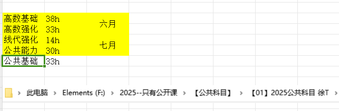
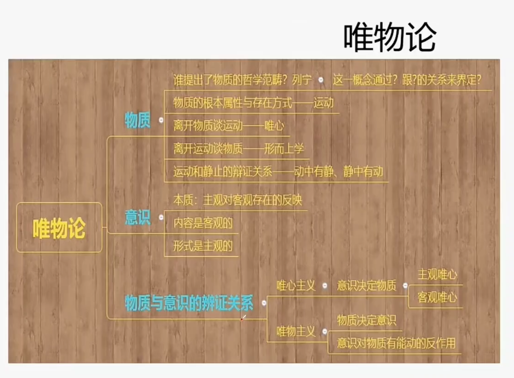
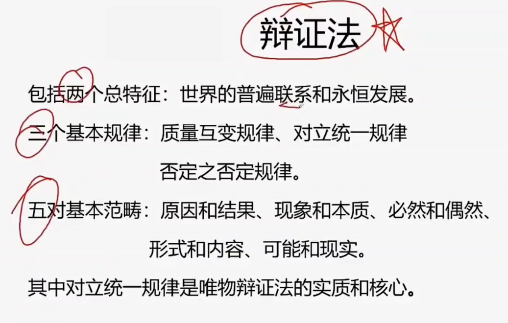
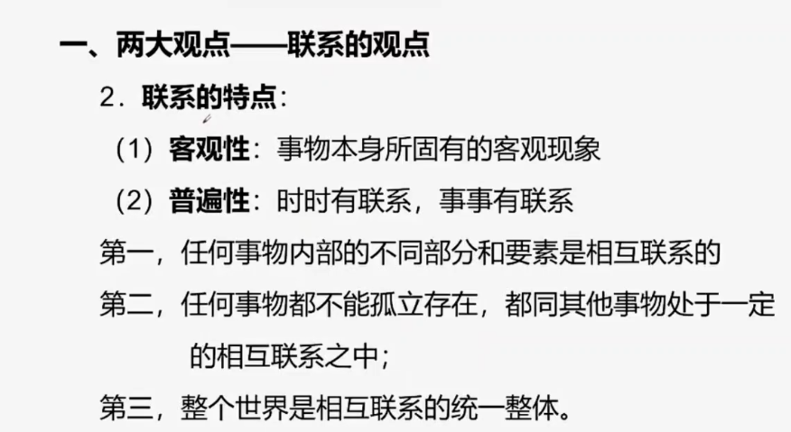
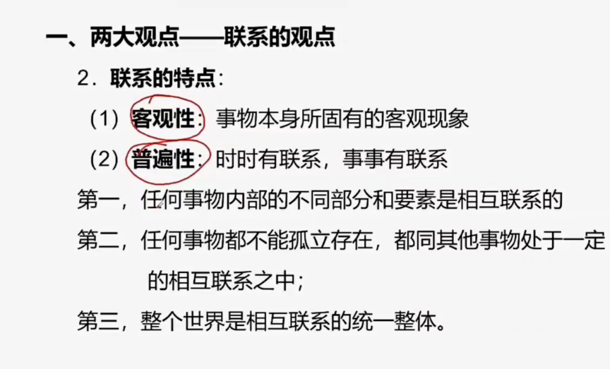

| 一  | 二  | 三  | 四  | 五  | 六  | 日  |
| --- | --- | --- | --- | --- | --- | --- |
| 1   | 1   | 1   | 1   | 1   | 4   | 4   |
| 1   | 1   | 1   | 1   | 1   | 4   | 4   |
|     |     | 3   |     | 3   |     |     |

高数基础 38 -- 6.29
高数强化 33 -- 7.6

公共能力 30 -- 7.13
公共基础 33 -- 7.20

线代强化 14 -- 7.27
----

$ \sqrt{s}  $
$ \widetilde{\int } $

