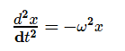
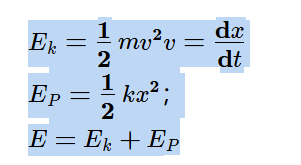

行间公式
$$
(1 + x)^n \geq 1 + nx \quad (x > -1, \ n \in \mathbb{N}^+ )
$$
行内公式$E=mc^2$

$$
\overrightarrow{F}=m\overrightarrow{a}
$$

## 物理学上册
### 运动动力学

### 电磁学

库伦定律
$$
\mathbf{F}=\frac{1}{4\pi\epsilon_0}\frac{q_1q_2}{r^2}\mathbf{e_{r}}
$$

电场强度
$$
\mathbf{E}=\frac{F}{q_0}
$$
电场中某点的电场强度$\mathbf{E}$等于该点处的单位试验电荷所受的电场力

电场强度叠加原理
点电荷系所激发的电场中某点处的电场强度等于各个点电荷单独存在时对该点所激起的电场强度的**矢量和**

### 电场强度通量和高斯定理
#### 电场线

#### 电场强度通量
把通过电场中某一个面的电场数目叫做通过这个面的**电场强度通量** 记作：$\Phi_{e}$

$$
\Phi_{e}=E\cdot S
$$
积分形式：
$$
\Phi_{e}=\int_{S}^{}E\cdot dS=\int_{S}^{}Ecos\theta dS
$$

#### 高斯定理

$$
\oint_{y}^{x}EdS=\frac{1}{\epsilon_0}\sum_{i=1}^{n}q_{i}^{}
$$
在真空静电场中，穿过任意闭合曲面的电场强度通量 = 该闭合曲面所包围的所有电荷的代数和除以$\epsilon_0$

### 静电场的环路定理和电势能

#### 静电场的环路定理

#### 电势能
实验电荷再电场中某处的电势能 == 把它从该点移动到零势能处静电场力所做的功

1. 电势能是个参考量，与零电势的选取有关
2. 

#### 电势
电场中某一点$A$的电势$V_{A}$等于把单位正试验电荷从点$A$ 移动到无限远处(电势为0)，静电力所做的功;记作：
$$
V_{A}=\int_{A\infty}^{}E\cdot dl
$$

电势差：两点电势的差值：$U_{AB}=V_{A}-V_{B}$
静电场中 A、B两点的电势差$U_{AB}$ 在数值上等于把单位正试验电荷从A移动到B ，静电场力做的功；

## 物理学下册
### 第九章：振动
#### 简谐振动
简谐振动的依据：$ F=-kx $
微分形式：

简谐振动方程：$x=A\cos\left(\omega t+\varphi\right)$
$$ v=\frac{\mathrm{d}x}{\mathrm{d}t} $$
$$ a=\frac{d^2x}{\mathrm{d}t^2} $$

A:振幅
T:周期：$ T=\frac{2\pi}{\omega} $ 其中：弹簧振子: $ \omega=\sqrt{\frac{k}{m}} $
$\nu$:频率: $ \nu=\frac{1}{T} $
$\omega t+\varphi$: 振动的相位
$\varphi$: 初相位

#### 单摆和复摆
$$ \frac{d^2\theta}{dt^2}=-\frac{g}{l}\theta $$
$ \omega=\sqrt{\frac{x}{l}} $
$ T=\frac{2\pi}{\omega}=2\pi\sqrt{\frac{x}{l}} $
#### 简谐振动的能量

### 第十章：波动
#### 机械波

波长$ \lambda $：一个完整波长的长度
周期$T$：波前进一个波长的距离所需要的时间
频率：$\nu=\frac{1}{T}$
波速：在波动过程中，某一个振动状态在单位时间内所传播的距离；也称相速(波长除以时间)$ u=\frac{\lambda}{T}$

$$
\sqrt{x}
$$
波函数
$
y=A\cos \left[ w\left( t-\frac{x}{u} \right) +\varphi \right] \,\,\varDelta t=\frac{x}{u}
$
$
y=A\cos \left[ 2\pi \left( \frac{t}{T}-\frac{x}{\lambda} \right) +\varphi \right] 
$

$
y=A\cos \left[ \omega t-\frac{2\pi x}{\lambda}+\varphi \right] 
$

波的干涉：
频率相同，振动方向平行，相位相同(或者相位差恒定的)的两列波相遇时，使得某些地方振动始终加强，而使得另外一些地方振动始终减弱的现象，称为波的干涉现象

干涉条件：波频率相同，振动方向相同，位相位差恒定； 满足干涉条件的波称为相干波
干涉现象：某些点振动始终加强，另一些点振动始终减弱或者完全抵消。

$$
y_p=y1+y_2=A\cos \left( \omega t+\varphi _3 \right) \,\,; A=\sqrt{A_{1}^{2}+A_{2}^{2}+2A_1A_1\cos \varDelta \varphi}
$$

$$
\varDelta \varphi =\left( \varphi _2-\frac{2\pi r_2}{\lambda} \right) -\left( \varphi _1-\frac{2\pi r_1}{\lambda} \right) 
$$

$\varDelta \varphi =2k\pi $ 合振幅最大
$\varDelta \varphi =(2k+1)\pi $ 合振幅最小

干涉的波程差条件：
当$\delta =r_1-r_2=2k\frac{\lambda}{2}$ (半波长的偶数倍)
合振幅最大:
当$\delta =r_1-r_2=(2k+1)\frac{\lambda}{2}$ (半波长的偶数倍)
合振幅最小:

### 第十一章：光学

### 第十二章：气体动理论

### 第十三章：热力学基础

### 第十四章：相对论

### 第十五章：量子力学
