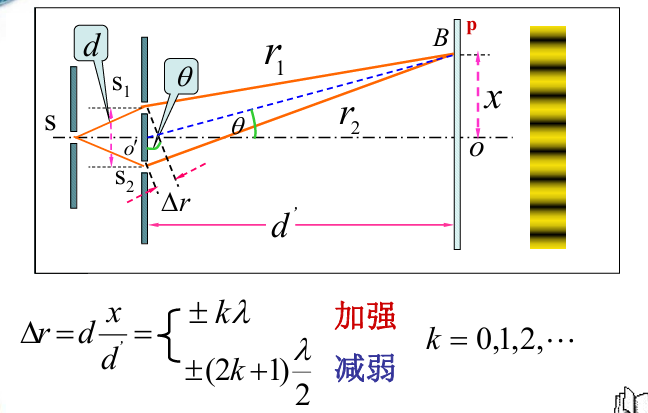
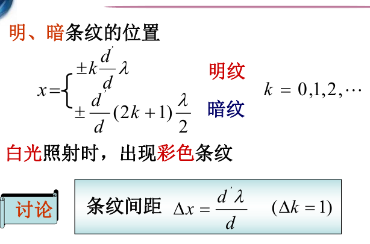
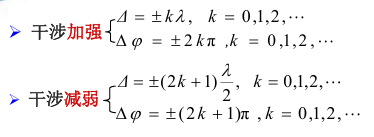
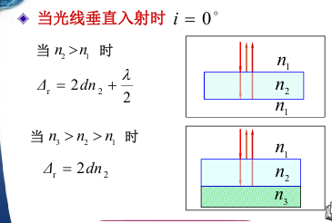
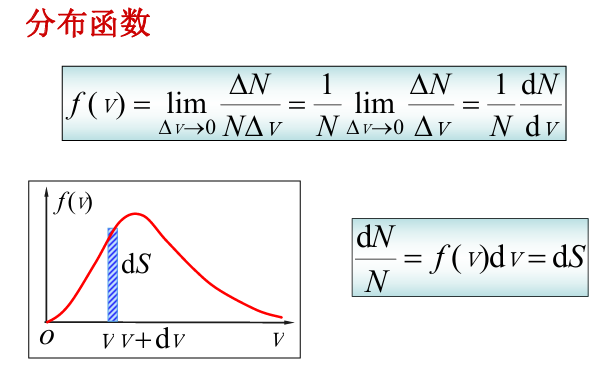

行间公式
$$
(1 + x)^n \geq 1 + nx \quad (x > -1, \ n \in \mathbb{N}^+ )
$$
行内公式$E=mc^2$

$$
\overrightarrow{F}=m\overrightarrow{a}
$$

## 物理学上册
### 运动动力学

### 电磁学

库伦定律
$$
\mathbf{F}=\frac{1}{4\pi\epsilon_0}\frac{q_1q_2}{r^2}\mathbf{e_{r}}
$$

电场强度
$$
\mathbf{E}=\frac{F}{q_0}
$$
电场中某点的电场强度$\mathbf{E}$等于该点处的单位试验电荷所受的电场力

电场强度叠加原理
点电荷系所激发的电场中某点处的电场强度等于各个点电荷单独存在时对该点所激起的电场强度的**矢量和**

### 电场强度通量和高斯定理
#### 电场线

#### 电场强度通量
把通过电场中某一个面的电场数目叫做通过这个面的**电场强度通量** 记作：$\Phi_{e}$

$$
\Phi_{e}=E\cdot S
$$
积分形式：
$$
\Phi_{e}=\int_{S}^{}E\cdot dS=\int_{S}^{}Ecos\theta dS
$$

#### 高斯定理

$$
\oint_{y}^{x}EdS=\frac{1}{\epsilon_0}\sum_{i=1}^{n}q_{i}^{}
$$
在真空静电场中，穿过任意闭合曲面的电场强度通量 = 该闭合曲面所包围的所有电荷的代数和除以$\epsilon_0$

### 静电场的环路定理和电势能

#### 静电场的环路定理

#### 电势能
实验电荷再电场中某处的电势能 == 把它从该点移动到零势能处静电场力所做的功

1. 电势能是个参考量，与零电势的选取有关
2. 

#### 电势
电场中某一点$A$的电势$V_{A}$等于把单位正试验电荷从点$A$ 移动到无限远处(电势为0)，静电力所做的功;记作：
$$
V_{A}=\int_{A\infty}^{}E\cdot dl
$$

电势差：两点电势的差值：$U_{AB}=V_{A}-V_{B}$
静电场中 A、B两点的电势差$U_{AB}$ 在数值上等于把单位正试验电荷从A移动到B ，静电场力做的功；

## 物理学下册
### 第九章：振动
#### 简谐振动
简谐振动的依据：$ F=-kx $
微分形式：

简谐振动方程：$x=A\cos\left(\omega t+\varphi\right)$
$$ v=\frac{\mathrm{d}x}{\mathrm{d}t} $$
$$ a=\frac{d^2x}{\mathrm{d}t^2} $$

A:振幅
T:周期：$ T=\frac{2\pi}{\omega} $ 其中：弹簧振子: $ \omega=\sqrt{\frac{k}{m}} $
$\nu$:频率: $ \nu=\frac{1}{T} $
$\omega t+\varphi$: 振动的相位
$\varphi$: 初相位

#### 单摆和复摆
$$ \frac{d^2\theta}{dt^2}=-\frac{g}{l}\theta $$
$ \omega=\sqrt{\frac{x}{l}} $
$ T=\frac{2\pi}{\omega}=2\pi\sqrt{\frac{x}{l}} $
#### 简谐振动的能量

### 第十章：波动
#### 机械波

波长$ \lambda $：一个完整波长的长度
周期$T$：波前进一个波长的距离所需要的时间
频率：$\nu=\frac{1}{T}$
波速：在波动过程中，某一个振动状态在单位时间内所传播的距离；也称相速(波长除以时间)$ u=\frac{\lambda}{T}$

$$
\sqrt{x}
$$
波函数
$
y=A\cos \left[ w\left( t-\frac{x}{u} \right) +\varphi \right] \,\,\varDelta t=\frac{x}{u}
$
$
y=A\cos \left[ 2\pi \left( \frac{t}{T}-\frac{x}{\lambda} \right) +\varphi \right] 
$

$
y=A\cos \left[ \omega t-\frac{2\pi x}{\lambda}+\varphi \right] 
$

波的干涉：
频率相同，振动方向平行，相位相同(或者相位差恒定的)的两列波相遇时，使得某些地方振动始终加强，而使得另外一些地方振动始终减弱的现象，称为波的干涉现象

干涉条件：波频率相同，振动方向相同，位相位差恒定； 满足干涉条件的波称为相干波
干涉现象：某些点振动始终加强，另一些点振动始终减弱或者完全抵消。

$$
y_p=y1+y_2=A\cos \left( \omega t+\varphi _3 \right) \,\,; A=\sqrt{A_{1}^{2}+A_{2}^{2}+2A_1A_1\cos \varDelta \varphi}
$$

$$
\varDelta \varphi =\left( \varphi _2-\frac{2\pi r_2}{\lambda} \right) -\left( \varphi _1-\frac{2\pi r_1}{\lambda} \right) 
$$

$\varDelta \varphi =2k\pi $ 合振幅最大
$\varDelta \varphi =(2k+1)\pi $ 合振幅最小

干涉的波程差条件：
当$\delta =r_1-r_2=2k\frac{\lambda}{2}$ (半波长的偶数倍)
合振幅最大:
当$\delta =r_1-r_2=(2k+1)\frac{\lambda}{2}$ (半波长的偶数倍)
合振幅最小:

相干波：
产生条件: 两列振幅相同的相干波相向传播
驻波方程：$ y=2A\cos 2\pi \frac{x}{\lambda}\cos 2\pi \nu t $

相位跃变(半波损失) -- 从波疏到波密介质

+ 多普勒效应
发射频率$\mathrm{v}$和接收频率$\mathrm{v}'$不相等

$$
\mathrm{v}'=\frac{\mathrm{u}\pm \mathrm{v}_0}{\mathrm{u}\mp \mathrm{v}_{\mathrm{s}}}\mathrm{\nu}
$$

$\mathrm{v}_0$ 观察者向波源运动 + 远离 -
$\mathrm{v}_{\mathrm{s}}$ 波源向观察者运动 - 远离 +

### 第十一章：光学

真空中的光速: $ \mathrm{c}=\frac{1}{\sqrt{\mathrm{\varepsilon}_0\mathrm{\mu}_0}} $

相干光的产生：
+ 振幅分割法
+ 波阵面分割法

劳埃德镜

光在真空中的速度：
光在介质中的速度：
介质中的波长：

光程：介质折射率与光的几何路程之积= `nr`
物理意义：光在介质中通过的几何路程折算到真空中的路程

光程差：两光程之差 $ \Delta =\mathrm{nr}_2-\mathrm{r}_1 $

相位差： $
\Delta \mathrm{\varphi}=2\mathrm{\pi}\frac{\Delta}{\mathrm{\lambda}} $

劈尖：

$ \Delta =2nd+\frac{\lambda}{2} $

牛顿环：
$ \Delta =2nd+\frac{\lambda}{2} $

迈克尔逊干涉仪：？

光的衍射：

单缝衍射：

$$
b\sin \theta =\pm 2k\frac{\lambda}{2}=\pm k\lambda 干涉相消(暗纹)
$$

$$
b\sin \theta =\pm \left( 2k+1 \right) \frac{\lambda}{2} 干涉相加(明纹)
$$

### 第十二章：气体动理论

$$
pV=\nu RT=\frac{m‘}{M}RT
$$

`m‘` 系统总质量 `m'=Nm`
`M` 摩尔质量  `M=NA m`
`m` 单个分子质量 

$$
p=nkT
$$

$k=\frac{R}{N_A}$ :玻尔兹曼常数
$n=\frac{N}{V}$   :气体分子数密度

$$
p=\frac{2}{3}n\overline{\varepsilon _k}
$$

$$
p=nkT
$$

$$
\overline{\varepsilon _k}=\frac{1}{2}m\overline{v^2}
$$

分子的平均能量：

理想气体的内能：分子动分子内原子间的势能
1mol 理想气体的内能：
$$
E=N_A\overline{\varepsilon }=\frac{i}{2}RT 
$$

理想气体的内能：
$$
E=\nu \frac{i}{2}RT
$$

理想气体内能变化：
$$
dE=\nu \frac{i}{2}RdT
$$

`f(v)`物理意义：
表示在温度T的平衡状态下，速率在`V附近`单位速率区间的分子数占总数的百分比

三种统计速率：
+ 最概然速率
$$
_p=\sqrt{2}\sqrt{\frac{kT}{m}}
$$

+ 平均速率
$$
\overline{v}=\sqrt{\frac{8}{\pi}}\sqrt{\frac{kT}{m}}
$$

+ 方均根速率
$$
\sqrt{\overline{v^2}}=\sqrt{3}\sqrt{\frac{kT}{m}}
$$

$$
v_p<\overline{v}<\sqrt{\overline{v^2}}
$$

### 第十三章：热力学基础
理想气体的内能：
表征系统状态的单值函数，理想气体的内能仅是温度的函数；系统内能的增量只和系统的始末状态有关，和系统经历的过程无关
$$
E=E\left( T \right) 
$$

`热力学第一定律`：
系统从外界吸收的热量，一部分使得系统的内能增加，另外一部分使系统对外界做功。
$$
Q=E_2-E_1+W=\varDelta E+W
$$
准静态过程：
$$
Q=\varDelta E+\int_{V1}^{V2}{pdV}
$$

微变过程：
$$
dQ=dE+dW=dE+pdV
$$

Q >0 系统吸热 <0 放热
$\varDelta E $ >0 内能增加，<0 内能减小
W >0 系统对外界做功，<0 外界对系统做功

理论基础公式:
$ pV=\nu RT $
$ Q=E_2-E_1+W=\varDelta E+\int_{V1}^{V2}{pdV} $
$ dQ=dE+dW=dE+pdV $
$ E=E\left( T \right)  $

#### 等容过程 摩尔定体热容
V 为常量

$ dV=0\ dW=0 $
$ dQ_v=dE=\nu \frac{i}{2}RdT $

摩尔定体热容：1mol 理想气体在等体过程中吸收热量为$ dQ_v $ =使得温度升高$dT$,其摩尔定体热容为：

$
C_{V,M}=\frac{dQ_V}{dT}
$

$\nu $mol理想气体:
$ dQ_V=\nu C_{V,M}dT $
由热力学第一定律:
$$
Q_V=\nu C_{V,M}\left( T_2-T_1 \right) =E_2-E_1
$$

#### 等压过程 摩尔定压热容
p为常量

`热力学第二定律`:
1. 不可能制造出这样一种循环工作的热机，它只使单一热源冷却来做功，而不放出热量给其他物体。或者说不使外界发生任何变化；

2. 不可能把热量从低温物体自动传到高温物体而不引起外界的变化 

### 第十四章：相对论
狭义相对论的基本原理：
+ 相对性原理：物理定律在所有的惯性系中都具有相同的表达形式；
+ 光速不变原理：真空中的光速是一个常量，沿各个方向都等于`c`,与光源或观测者的远动状态无关，

洛伦兹坐标变换式：
$$
\begin{cases}
	\beta =v/v\\
	\gamma =\sqrt{1-\beta ^2}\\
\end{cases}
$$

$$
\text{洛伦兹坐标正变换}\begin{cases}
	x'=\frac{x-vt}{\sqrt{1-\beta ^2}}=\gamma \left( x-vt \right)\\
	y'=y\\
	z'=z\\
	t'=\frac{t-\frac{v}{c^2}x}{\sqrt{1-\beta ^2}}=\gamma \left( t-\frac{v}{c^2}x \right)\\
\end{cases}
$$
$$
\text{洛伦兹坐标反变换}\begin{cases}
	x=\gamma \left( x'+vt' \right)\\
	y=y'\\
	z=z'\\
	t=\gamma \left( t'+\frac{v}{c^2}x' \right)\\
\end{cases}
$$

$$
\text{洛伦兹速度正变换}\begin{cases}
	u_{x}^{'}=\frac{u_x-v}{1-\frac{v}{c^2}u_x}\\
	u_{y}^{'}=\frac{u_y}{\gamma \left( 1-\frac{v}{c^2}u_x \right)}\\
	u_{z}^{'}=\frac{u_x}{\gamma \left( 1-\frac{v}{c^2}u_x \right)}\\
\end{cases}
$$

$$
\text{洛伦兹速度逆变换}\begin{cases}
	u_x=\frac{u_{x}^{'}+v}{1+\frac{v}{c^2}u_{x}^{'}}\\
	u_y=\frac{u_{y}^{'}}{\gamma \left( 1+\frac{v}{c^2}u_{x}^{'} \right)}\\
	u_z=\frac{u_{z}^{'}}{\gamma \left( 1+\frac{v}{c^2}u_{x}^{'} \right)}\\
\end{cases}
$$

s'系中 ：
+ 物体在运动方向上长度收缩
+ 时间延缓

相对论下的速度和动量
1. 相对论动量遵循洛伦兹变换
$$
\text{相对论动量：}\overrightarrow{p}=\frac{m_0\overrightarrow{v}}{\sqrt{1-\beta ^2}}=\gamma m_0\overrightarrow{v}
$$

2. 相对论质量
$$
\text{相对论质量：}m=\frac{m_0}{\sqrt{1-\beta ^2}}
$$
$$
\text{相对论动能：}E_k=mc^2-m_0c^2
$$
$$
\text{静能量：}E_0=m_0c^2
$$

$$
\text{总能量：}E=E_k+E_0=mc^2
$$
$$
\text{相对论质能关系：}E=mc^2
$$

### 第十五章：量子力学

