#### 4.10哈夫曼编码代码演示

#### 4.11

#### 4.12

#### 4.13 哈夫曼编码代码演示 


#### 80 丑数

#### 95 ok


38 HZ_595 ok
39 HZ_838 
HZ
## 第六章排序算法
84 选择排序
85 插入排序
86 无监督的插入排序
87 希尔排序(分组插入排序)

本章题目:
leetcode 01 148 77 21 04 219 
HZOJ 248 251 256

##  第8章平衡树基础
### 二叉排序树
二叉排序树，二叉搜索树
(中序遍历有序，左子树值<根<右子树)

+ 插入节点

+ 删除节点
【删除叶子节点】
直接删除

【删除出度为1的节点】
唯一的子孩子进行提升

【删除度为2的节点】
找到前驱或者后继替换后转换为度为1的节点问题
前驱,后继：中序遍历后前面的节点和后面的节点
前驱为左子树中最大的值（也就是左子树最右的节点）
后继为右子树中最小的值（也就是右子树中最左的节点）
前驱和后继只能为 出度为0 或者出度为1 的节点


### AVL树
```
二叉排序树+ 左右子树树高差不超过1
| H(left) - H(right) | <= 1
```
优点：


### 红黑树


### B-树


## 第9章递归函数转非递归
???
拓扑序知识讲解

## 第10章 森林与并查集


## 第11章 单调队列与单调栈


## 第12章 回溯算法

## 第13章 贪心算法
 
