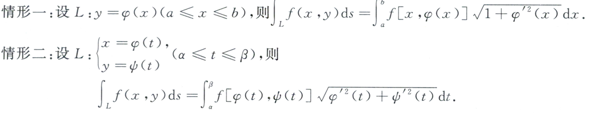
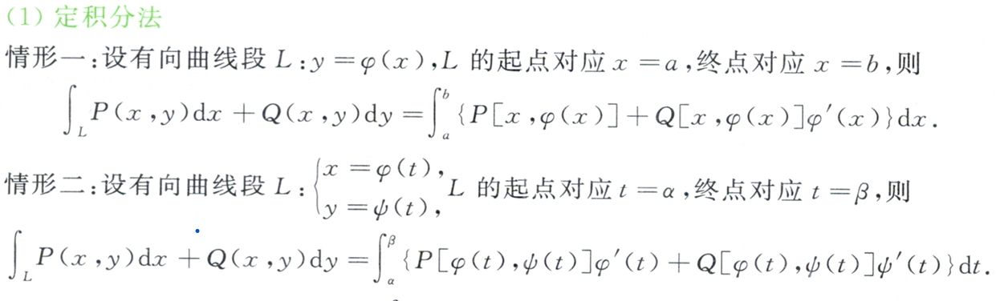
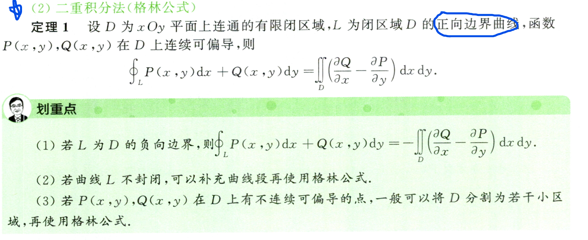
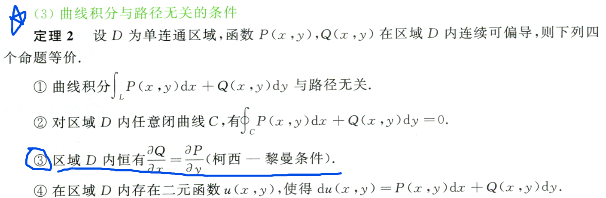
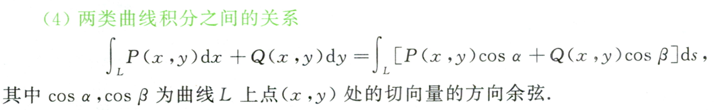
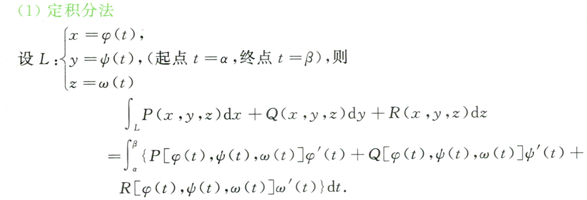
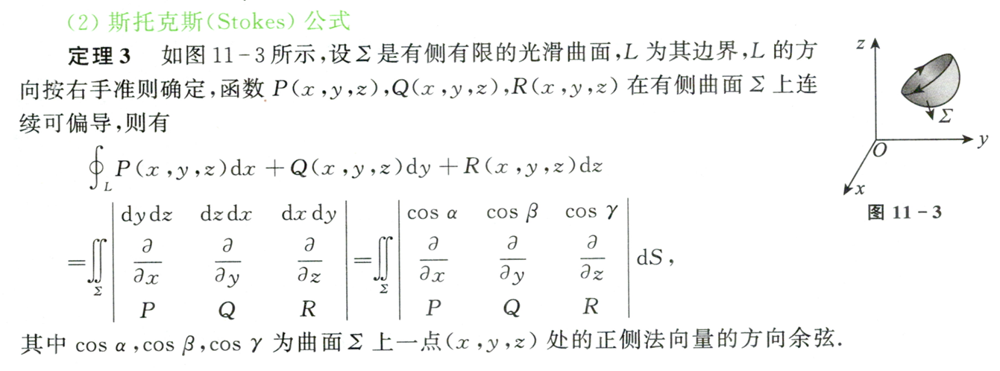
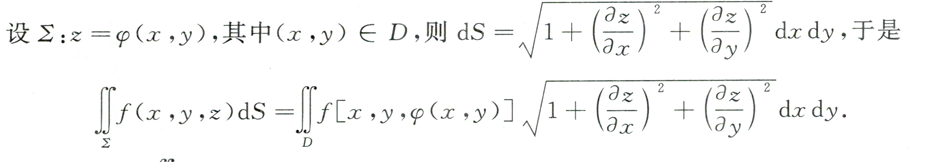
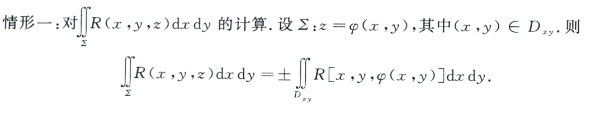
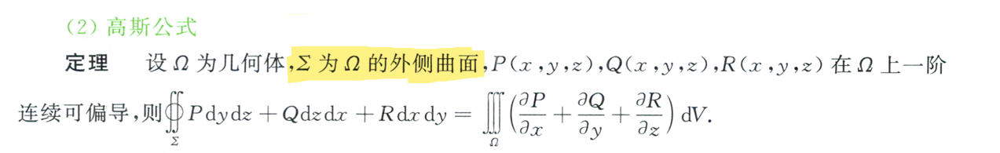

# 微分方程
## 可分离微分方程(DE)

## 齐次DE

$$
\frac{dy}{dx}=\varphi \left( \frac{y}{x} \right) 
$$

令 $ u=\frac{y}{x} $ 则 

## 一阶非齐次线性DE
$$
\frac{dy}{dx}+P_{\left( x \right)}y=Q_{\left( x \right)}
$$

通解：
$$
y=\left[ \int{Qe^{-\int{P\,\,dx}}}dx\,\,+\,\,C \right] e^{-\int{P\,\,dx}}
$$

## 一阶齐次线性DE
$$
\frac{dy}{dx}+P_{\left( x \right)}y=0
$$

通解：
$$
y=Ce^{-\int{P\,\,dx}}
$$

## 伯努利方程

## 可降阶DE

    + 缺 x 型
    + 缺 y 型

## 高阶DE

### 高阶线性DE
#### n阶齐次线性DE

#### n阶非齐次线性DE

#### 解的结构

### 高阶常系数线性DE

#### 二阶常系数齐次DE ---- 通解
$$
y''+py'+qy=0
$$

**(1)** 求解方程 $y''+py'+qy=0$ 的特征方程 $\lambda ^2+p\lambda +q=0$

**(2)** 根据特征方程根的不同分为三种情况
① 两个不同的实根-------- $ \lambda _1\ne \lambda _2 $

$$
y=C_1e^{\lambda _1x}+\,\,C_2e^{\lambda _2x}
$$

② 两个相同的实根-------- $ \lambda _1=\lambda _2 $

$$
y=\left( C_1+C_2x \right) e^{\lambda _1x}
$$

③ 一对共轭虚根-------- $ \lambda _{1,2}=\alpha +i\beta  $

$$
y=e^{\alpha x}\left( C_1\cos \beta x+C_2\sin \beta x \right) 
$$

#### 二阶常系数非齐DE ---- 特解

$$
y''+py'+qy=f_{\left( x \right)}
$$
根据f(x) 的不同形式，求特解的方程分为下面两种情况

**(1)**  $ f\left( x \right) =P_n\left( x \right) e^{\begin{array}{c}
	kx\\
\end{array}}$ 

情形①：`k` 非特征根
$$
y_0=Q_n\left( x \right) e^{\begin{array}{c}
	kx\\
\end{array}}:Q_n\left( x \right) \text{为与}P_n\left( x \right) \text{同阶的完整多项式}
$$

情形②：`k` 与一个特征根相同

$$
y_0=xQ_n\left( x \right) e^{\begin{array}{c}
	kx\\
\end{array}}:Q_n\left( x \right) \text{为与}P_n\left( x \right) \text{同阶的完整多项式}
$$

情形③：`k` 与两个特征根都相同

$$
y_0=x^2Q_n\left( x \right) e^{\begin{array}{c}
	kx\\
\end{array}}:Q_n\left( x \right) \text{为与}P_n\left( x \right) \text{同阶的完整多项式}
$$

**(2)**  $
f\left( x \right) =e^{\begin{array}{c}
	\alpha x\\
\end{array}}\left[ P_l\left( x \right) \cos  \beta x+P_s\left( x \right) \sin  \beta x \right] 
$

令：$
n=\max \left\{ l,s \right\} 
$

情形①：$ \alpha +i\beta  $ 不是特征根

$$
y_0=e^{\begin{array}{c}
	\alpha x\\
\end{array}}\left[ Q_{n1}\left( x \right) \cos  \beta x+Q_{n2}\left( x \right) \sin  \beta x \right] 
$$

情形②：$ \alpha +i\beta  $ 是特征根
$$
y_0=xe^{\begin{array}{c}
	\alpha x\\
\end{array}}\left[ Q_{n1}\left( x \right) \cos  \beta x+Q_{n2}\left( x \right) \sin  \beta x \right] 
$$

## 解题思路
1. 判断微分方程类型（判断顺序-- 可分离 ，齐次 -- 一阶齐/非齐线性   -- 二阶常系数齐/非齐）

# 积分

## 不定积分

## 定积分

## 二重积分

## 三重积分

## 曲线积分
### 第一类曲线积分
计算方法：
①： 特殊替代法

②：定积分法
情形一：直角坐标方程
情形二：参数方程

### 第二类曲线积分
#### 二维空间对坐标的曲线积分的计算方法
（1）定积分法

（2）格林公式

（3）曲线积分与路径无关的条件

（4）两类曲线积分之间的关系

#### 三维空间对坐标的曲线积分的计算方法
（1）定积分法

（2）斯托克斯公式

## 曲面积分
### 第一类曲面积分
计算方法：
①： 特殊替代法

②：二重积分法

### 第二类曲面积分

计算方法：
①：二重积分法

人站在Z轴向下看，看到的一侧为正，看不到的一侧为负

$$
\iint\limits_{\varSigma}^{}{R\left( x,y,z \right) dxdy\,\,}=\pm \iint\limits_{D_{xy}}^{}{R\left( x,y,\varphi _{\left( x,y \right)} \right) dxdy\,\,}
$$

$$
\iint\limits_{\varSigma}^{}{P\left( x,y,z \right) dydz\,\,}=\pm \iint\limits_{D_{yz}}^{}{P\left( \varphi _{\left( y,z \right)},y,z \right) dydz\,\,}
$$

$$
\iint\limits_{\varSigma}^{}{Q\left( x,y,z \right) dzdx\,\,}=\pm \iint\limits_{D_{zx}}^{}{Q\left( x,\varphi _{\left( x,z \right)},z \right) dzdx\,\,}
$$

②：高斯公式
